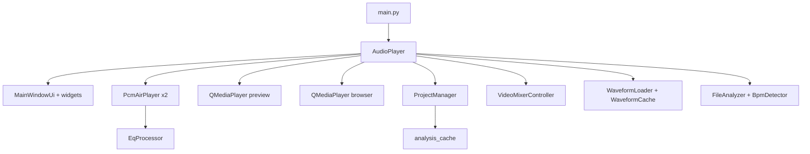

# Учебник по коду SimpleAudioPlayer (Decibel Player)

Документ для изучения исходного кода: назначение модулей, переменных, классов и функций.

**Стек:** Python 3, PyQt6, numpy, librosa (опционально), PyAV, pydub.

### Как пользоваться

1. Начните с раздела [Архитектура](#архитектура) и [Карта модулей](#карта-модулей) — общая картина.
2. Для каждого `.py` файла в документе указаны: назначение, **переменные/константы**, **функции**, **классы** с полями и методами.
3. Сигнатуры взяты из исходного кода; описания — из docstring или краткого пояснения. Методы с префиксом `_` помечены как *(внутр.)* — служебные.
4. Класс `AudioPlayer` (~300 методов) описан полностью в разделе `app/player.py` и сгруппирован в [Приложении](#приложение-audioplayer).

### Рекомендуемый порядок изучения

| Этап | Модули | Зачем |
|------|--------|-------|
| 1 | `main.py` → `player.py` (обзор) | Точка входа и главный контроллер |
| 2 | `constants`, `config`, `time_utils` | Базовые утилиты |
| 3 | `playlist_io`, `playlist_widget` | Как хранятся треки в плейлисте |
| 4 | `pcm_air_player`, `eq_state`, `eq_dsp` | Эфирное воспроизведение и EQ |
| 5 | `waveform_loader`, `analysis_cache`, `audio_waveform` | Waveform на экране |
| 6 | `bpm_detector`, `file_analyzer` | Фоновый анализ |
| 7 | `project` | Проекты и файловая структура |
| 8 | `ui/*`, `widgets/*` | Интерфейс |
| 9 | `video_mixer/*` | Видеомикшер (отдельная подсистема) |

---

## Содержание

- [Архитектура](#архитектура)
- [Карта модулей](#карта-модулей)
- [Корень проекта](#корень-проекта)
- [Пакет app/ — ядро](#пакет-app---ядро)
- [app/ui/](#appui)
- [app/widgets/](#appwidgets)
- [app/video_mixer/](#appvideo_mixer)
- [scripts/](#scripts)
- [Приложение: AudioPlayer](#приложение-audioplayer)

---

## Архитектура

### Потоки данных

| Подсистема | Модули | Описание |
|------------|--------|----------|
| Эфир | `pcm_air_player`, `eq_dsp` | Два дека PCM с EQ на выходе |
| Preview / Browser | `player` + QMediaPlayer | Предпрослушивание без EQ эфира |
| Waveform | `waveform_loader`, `analysis_cache` | Peaks для отрисовки |
| Проект | `project`, `playlist_io` | JSON + media/analysis |
| Видео | `video_mixer/*` | Сцены, слои, GL-композит |

---

## Карта модулей

| Модуль | Назначение |
|--------|------------|
| `app/analysis_cache.py` | Дисковый кэш анализа (BPM + waveform peaks) в NPZ. |
| `app/audio_devices.py` | Перечисление аудиовыходов Qt и работа с комбобоксами устройств. |
| `app/audio_loader.py` | Загрузка моно PCM-сэмплов из файлов (ffmpeg, pydub, wav). |
| `app/audio_utils.py` | Проверка типа файла и генерация данных для отображения waveform. |
| `app/bpm_detector.py` | Определение BPM (librosa + fallback) в фоновом потоке. |
| `app/config.py` | Пути к файлам конфигурации в домашней директории пользователя. |
| `app/constants.py` | Глобальные константы приложения (расширения аудио, имя, лимиты). |
| `app/duration_prober.py` | Асинхронное определение длительности треков через QMediaPlayer. |
| `app/eq_curve.py` | Расчёт частотной характеристики EQ для отображения на графике. |
| `app/eq_dsp.py` | Real-time обработка PCM каскадом RBJ biquad-фильтров. |
| `app/eq_state.py` | Модель состояния параметрического EQ (полосы, bypass). |
| `app/file_analyzer.py` | Фоновая очередь анализа файлов (BPM + waveform). |
| `app/pcm_air_player.py` | PCM-плеер эфира с realtime EQ и спектром (замена QMediaPlayer). |
| `app/player.py` | Главное окно приложения: плейлисты, эфир, preview, browser, проект. |
| `app/playlist_io.py` | Сериализация плейлистов и роли данных элементов списка. |
| `app/project.py` | Структура папки проекта, импорт медиа, save/load project.json. |
| `app/spectrum_feeder.py` | Боковой канал FFT-спектра для EQ-панели (не эфирный путь). |
| `app/time_utils.py` | Форматирование времени и определение длительности аудиофайлов. |
| `app/ui/about_dialog.py` | Диалог «О программе». |
| `app/ui/assets.py` | Разрешение путей к иконкам и ассетам Figma. |
| `app/ui/generated/ui_main_window.py` | Сгенерированный pyuic6 layout (legacy). |
| `app/ui/icon_loader.py` | HiDPI-загрузка и кэширование иконок. |
| `app/ui/main_window_ui.py` | Построение layout главного окна (Figma Music Player). |
| `app/ui/paths.py` | Пути к UI-ресурсам. |
| `app/ui/styles.py` | Загрузка QSS-стилей и применение темы приложения. |
| `app/ui/tokens.py` | Design tokens из tokens.json для QSS-подстановки. |
| `app/ui/widgets/float_value_stepper.py` | Виджет шага float-значения. |
| `app/ui/widgets/section_header.py` | Заголовок секции UI. |
| `app/ui/widgets/segment_button.py` | Группа взаимоисключающих кнопок-сегментов. |
| `app/ui/widgets/square_checkbox.py` | Кастомный квадратный чекбокс. |
| `app/ui/widgets/value_stepper.py` | Виджет шага целочисленного значения. |
| `app/video_mixer/compositor.py` | OpenGL-композитор слоёв. |
| `app/video_mixer/controller.py` | Контроллер видеомикшера: UI, рендер, output window. |
| `app/video_mixer/decoder.py` | Фасад изолированного декодера видео. |
| `app/video_mixer/decoder_pool.py` | Пул долгоживущих процессов декодирования. |
| `app/video_mixer/decoder_worker.py` | Дочерний процесс PyAV для декода видео. |
| `app/video_mixer/gl_widget.py` | Виджеты GL/Canvas для preview и output. |
| `app/video_mixer/layer_audio.py` | Аудио слоёв видео через QMediaPlayer. |
| `app/video_mixer/layer_list.py` | Список слоёв с drag-and-drop. |
| `app/video_mixer/media_store.py` | Буферы кадров слоёв и синхронизация с декодерами. |
| `app/video_mixer/media_utils.py` | Определение типа медиафайла (image/video). |
| `app/video_mixer/model.py` | Модель данных видеомикшера (сцены, слои, трансформы). |
| `app/video_mixer/output_window.py` | Окно вывода на физический монитор. |
| `app/video_mixer/panel.py` | UI-панель видеомикшера. |
| `app/video_mixer/scene_render.py` | Offscreen-рендер сцены для превью/миниатюр. |
| `app/volume_fader.py` | Линейное затухание/нарастание громкости по таймеру UI. |
| `app/waveform_cache.py` | In-memory LRU-кэш сгенерированных waveform peaks. |
| `app/waveform_loader.py` | Фоновая генерация waveform peaks в отдельном потоке. |
| `app/widgets/audio_waveform.py` | Интерактивный waveform с range, fade, zoom и scrub. |
| `app/widgets/file_browser.py` | Боковой файловый браузер с вкладками и preview. |
| `app/widgets/file_properties_panel.py` | Панель EQ/спектра и метаданных preview. |
| `app/widgets/parametric_eq_view.py` | Редактор параметрического EQ (Pro-Q style). |
| `app/widgets/playlist_item_delegate.py` | Отрисовка строк плейлиста (время, BPM, цвет). |
| `app/widgets/playlist_widget.py` | Плейлист с drag-and-drop и переносом между списками. |
| `main.py` | Точка входа приложения: запуск Qt, тема, главное окно. |
| `scripts/compile_ui.py` | Компиляция .ui и .qrc для PyQt6. |

---

## Корень проекта

### `main.py`

**Назначение:** Точка входа приложения: запуск Qt, тема, главное окно.

**Функции модуля:**

| Сигнатура | Описание |
|-----------|----------|
| `def main()` | главная функция запуска |

---

## Пакет app/ — ядро

### `app/analysis_cache.py`

**Назначение:** Дисковый кэш анализа (BPM + waveform peaks) в NPZ.

> On-disk cache for file analysis (BPM + canonical waveform peaks).

**Переменные и константы модуля:**

| Имя | Описание |
|-----|----------|
| `CANONICAL_WAVEFORM_BARS` | — |
| `_cache_dir_override` | аннотированная переменная модуля *(приватная)* |

**Функции модуля:**

| Сигнатура | Описание |
|-----------|----------|
| `def set_cache_dir(path: Path | str | None) -> None` | Use a project-local analysis folder, or None for the global app cache. |
| `def get_cache_dir() -> Path` | — |
| `def _cache_dir() -> Path` | внутренняя функция/метод *(внутр.)* |
| `def _file_fingerprint(file_path: str) -> tuple[str, float, int] | None` | внутренняя функция/метод *(внутр.)* |
| `def _cache_path(file_path: str) -> Path | None` | внутренняя функция/метод *(внутр.)* |
| `def resample_peaks(peaks: list[float], num_bars: int) -> list[float]` | Resample peak envelope to a different bar count (max-pool down / linear up). |
| `def load_analysis(file_path: str) -> AnalysisCacheEntry | None` | загрузить BPM+peaks из NPZ-кэша |
| `def _load_npz(path: Path, file_path: str) -> AnalysisCacheEntry | None` | внутренняя функция/метод *(внутр.)* |
| `def _load_by_digest(file_path: str, folder: Path | None) -> AnalysisCacheEntry | None` | внутренняя функция/метод *(внутр.)* |
| `def save_analysis(file_path: str, bpm: float | None, peaks: list[float], num_bars: int) -> bool` | сохранить анализ в NPZ |
| `def has_waveform_cache(file_path: str) -> bool` | — |
| `def load_bpm(file_path: str) -> float | None` | — |
| `def load_peaks(file_path: str, num_bars: int | None) -> list[float] | None` | — |
| `def relocate_analysis(old_path: str, new_path: str) -> bool` | Copy analysis entry from old file path key to new path key. |
| `def export_analysis_to_dir(file_path: str, dest_dir: Path | str) -> bool` | Write current analysis for file_path into dest_dir (using that dir as cache). |
| `def copy_cache_file_for_path(file_path: str, dest_dir: Path | str) -> bool` | Copy the on-disk NPZ for file_path into dest_dir if present. |

#### Класс `AnalysisCacheEntry`

**Атрибуты / поля:**

| Имя | Описание |
|-----|----------|
| `bpm` | поле класса |
| `peaks` | поле класса |
| `num_bars` | поле класса |

---

### `app/audio_devices.py`

**Назначение:** Перечисление аудиовыходов Qt и работа с комбобоксами устройств.

**Переменные и константы модуля:**

| Имя | Описание |
|-----|----------|
| `NO_OUTPUT_DEVICE_ID` | — |
| `NO_OUTPUT_CONFIG_VALUE` | — |
| `NO_OUTPUT_LABEL` | — |

**Функции модуля:**

| Сигнатура | Описание |
|-----------|----------|
| `def is_no_output_device(device_id: bytes | None) -> bool` | — |
| `def device_id_to_config(device_id: bytes) -> str` | — |
| `def device_id_from_config(value: str) -> bytes | None` | — |
| `def find_audio_output(device_id: bytes | None) -> QAudioDevice` | — |
| `def populate_audio_output_combo(combo: QComboBox, saved_device_id: bytes | None) -> None` | — |
| `def refresh_audio_output_combos(*combos) -> None` | Re-enumerate system outputs, preserving each combo's current selection. |
| `def combo_selected_device_id(combo: QComboBox) -> bytes | None` | — |

---

### `app/audio_loader.py`

**Назначение:** Загрузка моно PCM-сэмплов из файлов (ffmpeg, pydub, wav).

**Переменные и константы модуля:**

| Имя | Описание |
|-----|----------|
| `_FFMPEG_PATH` | аннотированная переменная модуля *(приватная)* |
| `_PYDUB_CONFIGURED` | внутренняя функция/метод *(приватная)* |

**Функции модуля:**

| Сигнатура | Описание |
|-----------|----------|
| `def find_ffmpeg() -> str | None` | — |
| `def _configure_pydub() -> None` | внутренняя функция/метод *(внутр.)* |
| `def _resample(samples, orig_rate: int, target_rate: int)` | внутренняя функция/метод *(внутр.)* |
| `def _samples_to_mono_float(raw: bytes, sample_width: int, channels: int)` | внутренняя функция/метод *(внутр.)* |
| `def _load_wav(file_path: str, sample_rate: int, max_seconds: float)` | внутренняя функция/метод *(внутр.)* |
| `def _load_with_ffmpeg(file_path: str, sample_rate: int, max_seconds: float)` | внутренняя функция/метод *(внутр.)* |
| `def _load_with_afconvert(file_path: str, sample_rate: int, max_seconds: float)` | внутренняя функция/метод *(внутр.)* |
| `def _load_with_pydub(file_path: str, sample_rate: int, max_seconds: float)` | внутренняя функция/метод *(внутр.)* |
| `def load_mono_samples(file_path: str, sample_rate: int, max_seconds: float)` | Load mono PCM samples as float32 numpy array. |

---

### `app/audio_utils.py`

**Назначение:** Проверка типа файла и генерация данных для отображения waveform.

**Функции модуля:**

| Сигнатура | Описание |
|-----------|----------|
| `def is_audio_file(file_path: str) -> bool` | проверка расширения аудиофайла |
| `def generate_waveform_data(file_path, num_bars, start_ms: int, end_ms: int | None)` | массив peaks для waveform |

---

### `app/bpm_detector.py`

**Назначение:** Определение BPM (librosa + fallback) в фоновом потоке.

**Переменные и константы модуля:**

| Имя | Описание |
|-----|----------|
| `ANALYSIS_MAX_SECONDS` | — |
| `TARGET_SAMPLE_RATE` | — |
| `HOP_LENGTH` | — |
| `MIN_BPM` | — |
| `MAX_BPM` | — |
| `SEGMENT_SECONDS` | — |
| `REFINE_WINDOW` | — |
| `REFINE_STEP` | — |

**Функции модуля:**

| Сигнатура | Описание |
|-----------|----------|
| `def _normalize_bpm(bpm: float) -> float` | внутренняя функция/метод *(внутр.)* |
| `def _read_bpm_from_metadata(file_path: str) -> int | None` | внутренняя функция/метод *(внутр.)* |
| `def _bpm_from_beat_times(beat_times) -> float | None` | внутренняя функция/метод *(внутр.)* |
| `def _score_tempo(onset_env, sr: int, bpm: float) -> float` | внутренняя функция/метод *(внутр.)* |
| `def _refine_bpm_with_comb(onset_env, sr: int, coarse_bpm: float) -> int` | внутренняя функция/метод *(внутр.)* |
| `def _collect_segment_estimates(samples, sr: int) -> list[int]` | внутренняя функция/метод *(внутр.)* |
| `def _consensus_integer_bpm(estimates: list[int]) -> int | None` | внутренняя функция/метод *(внутр.)* |
| `def _detect_bpm_librosa(samples, sr: int) -> int | None` | внутренняя функция/метод *(внутр.)* |
| `def _detect_bpm_fallback(samples, sr: int) -> int | None` | внутренняя функция/метод *(внутр.)* |
| `def detect_bpm(file_path: str) -> int | None` | определить BPM файла |

#### Класс `_BpmJob`

**Атрибуты / поля:**

| Имя | Описание |
|-----|----------|
| `file_path` | поле класса |
| `item` | поле класса |
| `for_playback` | поле класса |

#### Класс `_BpmWorker`

**Атрибуты / поля:**

| Имя | Описание |
|-----|----------|
| `finished` | атрибут класса |

**Методы:**

| Сигнатура | Описание |
|-----------|----------|
| `def __init__(file_path: str)` | конструктор |
| `def run() -> None` | — |

#### Класс `BpmDetector`

Detects BPM in a background thread queue.

**Атрибуты / поля:**

| Имя | Описание |
|-----|----------|
| `bpm_detected` | атрибут класса |
| `item_bpm_updated` | атрибут класса |

**Методы:**

| Сигнатура | Описание |
|-----------|----------|
| `def __init__(parent: QObject | None)` | конструктор |
| `def request_bpm(file_path: str) -> None` | — |
| `def request_item_bpm(item: QListWidgetItem, file_path: str, force: bool) -> None` | — |
| `def analyze_playlist(playlist, only_missing: bool) -> int` | — |
| `def _enqueue(job: _BpmJob, front: bool) -> None` | внутренняя функция/метод *(внутр.)* |
| `def _start_next() -> None` | внутренняя функция/метод *(внутр.)* |
| `def _cancel_worker() -> None` | внутренняя функция/метод *(внутр.)* |
| `def _on_worker_finished(file_path: str, bpm: object) -> None` | внутренняя функция/метод *(внутр.)* |
| `def shutdown() -> None` | корректное завершение фоновых потоков |

---

### `app/config.py`

**Назначение:** Пути к файлам конфигурации в домашней директории пользователя.

**Функции модуля:**

| Сигнатура | Описание |
|-----------|----------|
| `def get_config_path(filename: str) -> Path` | путь к файлу в ~/.simple_audio_player/ |

---

### `app/constants.py`

**Назначение:** Глобальные константы приложения (расширения аудио, имя, лимиты).

**Переменные и константы модуля:**

| Имя | Описание |
|-----|----------|
| `AUDIO_EXTENSIONS` | — |
| `MAX_PLAYLISTS` | — |
| `APP_NAME` | — |

---

### `app/duration_prober.py`

**Назначение:** Асинхронное определение длительности треков через QMediaPlayer.

#### Класс `DurationProber`

**Атрибуты / поля:**

| Имя | Описание |
|-----|----------|
| `PROBE_TIMEOUT_MS` | атрибут класса |
| `itemProbed` | атрибут класса |

**Методы:**

| Сигнатура | Описание |
|-----------|----------|
| `def __init__(parent)` | конструктор |
| `def probe_item(item: QListWidgetItem, file_path: str) -> None` | — |
| `def probe_playlist(playlist) -> None` | — |
| `def _start_next() -> None` | внутренняя функция/метод *(внутр.)* |
| `def _on_duration_changed(duration_ms: int) -> None` | внутренняя функция/метод *(внутр.)* |
| `def _on_timeout() -> None` | внутренняя функция/метод *(внутр.)* |

---

### `app/eq_curve.py`

**Назначение:** Расчёт частотной характеристики EQ для отображения на графике.

> EQ frequency-response helpers (RBJ biquads) for UI curve visualization.

**Переменные и константы модуля:**

| Имя | Описание |
|-----|----------|
| `_CURVE_SR` | внутренняя функция/метод *(приватная)* |
| `_CURVE_POINTS` | внутренняя функция/метод *(приватная)* |

**Функции модуля:**

| Сигнатура | Описание |
|-----------|----------|
| `def log_freq_axis(n: int) -> np.ndarray` | — |
| `def _biquad_peaking(f0: float, db_gain: float, q: float, sr: float) -> tuple[np.ndarray, np.ndarray]` | внутренняя функция/метод *(внутр.)* |
| `def _biquad_lowshelf(f0: float, db_gain: float, q: float, sr: float) -> tuple[np.ndarray, np.ndarray]` | внутренняя функция/метод *(внутр.)* |
| `def _biquad_highshelf(f0: float, db_gain: float, q: float, sr: float) -> tuple[np.ndarray, np.ndarray]` | внутренняя функция/метод *(внутр.)* |
| `def _biquad_lowpass(f0: float, q: float, sr: float) -> tuple[np.ndarray, np.ndarray]` | внутренняя функция/метод *(внутр.)* |
| `def _biquad_highpass(f0: float, q: float, sr: float) -> tuple[np.ndarray, np.ndarray]` | внутренняя функция/метод *(внутр.)* |
| `def band_coeffs(band: EqBand, sr: float) -> tuple[np.ndarray, np.ndarray] | None` | — |
| `def _mag_db_for_biquad(b: np.ndarray, a: np.ndarray, freqs: np.ndarray, sr: float) -> np.ndarray` | внутренняя функция/метод *(внутр.)* |
| `def response_db(bands: Iterable[EqBand], freqs: np.ndarray | None, bypass: bool, sr: float) -> tuple[np.ndarray, np.ndarray]` | Return (freqs_hz, magnitude_db) for the cascade of enabled bands. |

---

### `app/eq_dsp.py`

**Назначение:** Real-time обработка PCM каскадом RBJ biquad-фильтров.

> Realtime parametric EQ: cascaded RBJ biquads (float32, interleaved).

**Функции модуля:**

| Сигнатура | Описание |
|-----------|----------|
| `def _band_is_identity(band: EqBand) -> bool` | внутренняя функция/метод *(внутр.)* |
| `def _build_filters(bands: Iterable[EqBand], sample_rate: float) -> list[tuple[np.ndarray, np.ndarray]]` | внутренняя функция/метод *(внутр.)* |

#### Класс `_Biquad`

**Атрибуты / поля:**

| Имя | Описание |
|-----|----------|
| `__slots__` | атрибут класса |

**Методы:**

| Сигнатура | Описание |
|-----------|----------|
| `def __init__(b: np.ndarray, a: np.ndarray)` | конструктор |
| `def reset() -> None` | — |
| `def process(samples: np.ndarray) -> np.ndarray` | — |

#### Класс `EqProcessor`

Per-channel biquad cascade. Thread-safe live coefficient swap.

**Методы:**

| Сигнатура | Описание |
|-----------|----------|
| `def __init__(channels: int, sample_rate: float)` | конструктор |
| `def sample_rate() -> float` | — |
| `def set_sample_rate(sample_rate: float) -> None` | — |
| `def set_state(state: EqState | None) -> None` | Swap coefficients immediately. Does not restart playback. |
| `def reset() -> None` | — |
| `def process_interleaved(interleaved: np.ndarray) -> np.ndarray` | Process float32 interleaved PCM; returns float32 interleaved. |

---

### `app/eq_state.py`

**Назначение:** Модель состояния параметрического EQ (полосы, bypass).

> Parametric EQ state: bands with freq / gain / Q / type.

**Переменные и константы модуля:**

| Имя | Описание |
|-----|----------|
| `BAND_TYPES` | — |
| `BAND_TYPE_LABELS` | — |
| `FREQ_MIN_HZ` | — |
| `FREQ_MAX_HZ` | — |
| `GAIN_MIN_DB` | — |
| `GAIN_MAX_DB` | — |
| `Q_MIN` | — |
| `Q_MAX` | — |
| `DEFAULT_Q` | — |
| `MAX_BANDS` | — |

**Функции модуля:**

| Сигнатура | Описание |
|-----------|----------|
| `def _clamp(value: float, lo: float, hi: float) -> float` | внутренняя функция/метод *(внутр.)* |
| `def _new_id() -> str` | внутренняя функция/метод *(внутр.)* |

#### Класс `EqBand`

**Атрибуты / поля:**

| Имя | Описание |
|-----|----------|
| `id` | поле класса |
| `freq_hz` | поле класса |
| `gain_db` | поле класса |
| `q` | поле класса |
| `type` | поле класса |
| `enabled` | поле класса |

**Методы:**

| Сигнатура | Описание |
|-----------|----------|
| `def __post_init__() -> None` | внутренняя функция/метод |
| `def normalize() -> None` | — |
| `def to_dict() -> dict[str, Any]` | сериализация в dict |
| `def from_dict(cls, data: dict[str, Any] | None) -> EqBand | None` | десериализация из dict |

#### Класс `EqState`

**Атрибуты / поля:**

| Имя | Описание |
|-----|----------|
| `bands` | поле класса |
| `bypass` | поле класса |
| `selected_id` | поле класса |

**Методы:**

| Сигнатура | Описание |
|-----------|----------|
| `def band_by_id(band_id: str | None) -> EqBand | None` | — |
| `def selected_band() -> EqBand | None` | — |
| `def select(band_id: str | None) -> None` | — |
| `def add_band(freq_hz: float, gain_db: float, q: float, type: str) -> EqBand | None` | — |
| `def remove_band(band_id: str) -> bool` | — |
| `def clear_bands() -> None` | — |
| `def reset() -> None` | — |
| `def enabled_bands() -> Iterable[EqBand]` | — |
| `def to_dict() -> dict[str, Any]` | сериализация в dict |
| `def from_dict(cls, data: dict[str, Any] | None) -> EqState` | десериализация из dict |

---

### `app/file_analyzer.py`

**Назначение:** Фоновая очередь анализа файлов (BPM + waveform).

> Background file analysis: BPM + canonical waveform, with disk cache.

#### Класс `_AnalyzeJob`

**Атрибуты / поля:**

| Имя | Описание |
|-----|----------|
| `file_path` | поле класса |
| `item` | поле класса |
| `force` | поле класса |

#### Класс `_AnalyzeWorker`

**Атрибуты / поля:**

| Имя | Описание |
|-----|----------|
| `finished` | атрибут класса |

**Методы:**

| Сигнатура | Описание |
|-----------|----------|
| `def __init__(file_path: str, force: bool)` | конструктор |
| `def run() -> None` | — |

#### Класс `FileAnalyzer`

Queue analysis jobs that produce BPM + waveform peaks.

**Атрибуты / поля:**

| Имя | Описание |
|-----|----------|
| `item_analyzed` | атрибут класса |
| `file_analyzed` | атрибут класса |
| `progress` | атрибут класса |
| `busyChanged` | атрибут класса |
| `statusChanged` | атрибут класса |

**Методы:**

| Сигнатура | Описание |
|-----------|----------|
| `def __init__(parent: QObject | None)` | конструктор |
| `def is_busy() -> bool` | — |
| `def analyze_playlist(playlist, only_missing: bool) -> int` | — |
| `def analyze_item(item: QListWidgetItem, file_path: str, force: bool) -> None` | — |
| `def _enqueue(job: _AnalyzeJob, front: bool) -> None` | внутренняя функция/метод *(внутр.)* |
| `def _set_busy(busy: bool) -> None` | внутренняя функция/метод *(внутр.)* |
| `def _start_next() -> None` | внутренняя функция/метод *(внутр.)* |
| `def _cancel_worker() -> None` | внутренняя функция/метод *(внутр.)* |
| `def _on_worker_finished(file_path: str, bpm: object, peaks: object) -> None` | внутренняя функция/метод *(внутр.)* |

---

### `app/pcm_air_player.py`

**Назначение:** PCM-плеер эфира с realtime EQ и спектром (замена QMediaPlayer).

> Air PCM player with realtime EQ (QMediaPlayer-compatible subset).
> EQ is applied at sink-read time (not decode), so coefficient changes are

**Переменные и константы модуля:**

| Имя | Описание |
|-----|----------|
| `_CHUNK_FRAMES` | внутренняя функция/метод *(приватная)* |
| `_QUEUE_MAX_CHUNKS` | внутренняя функция/метод *(приватная)* |
| `_TARGET_CHANNELS` | внутренняя функция/метод *(приватная)* |
| `_FALLBACK_RATE` | внутренняя функция/метод *(приватная)* |
| `_DECODE_PACE_DEPTH` | внутренняя функция/метод *(приватная)* |
| `_DECODE_PACE_SLEEP_S` | внутренняя функция/метод *(приватная)* |
| `_SPECTRUM_PCM_SAMPLES` | внутренняя функция/метод *(приватная)* |
| `_SPECTRUM_CAPTURE_EVERY` | внутренняя функция/метод *(приватная)* |
| `_SPECTRUM_BINS` | внутренняя функция/метод *(приватная)* |
| `_PREBUFFER_CHUNKS` | внутренняя функция/метод *(приватная)* |
| `_PREBUFFER_TIMEOUT_S` | внутренняя функция/метод *(приватная)* |
| `_PUT_TIMEOUT_S` | внутренняя функция/метод *(приватная)* |
| `_LOW_WATER_CHUNKS` | внутренняя функция/метод *(приватная)* |

**Функции модуля:**

| Сигнатура | Описание |
|-----------|----------|
| `def _frame_to_stereo_interleaved(arr: np.ndarray) -> np.ndarray` | Convert PyAV ndarray to float32 interleaved stereo. *(внутр.)* |

#### Класс `AirAudioOutput`

Volume / mute / device facade matching QAudioOutput usage in player.py.

**Методы:**

| Сигнатура | Описание |
|-----------|----------|
| `def __init__(player: 'PcmAirPlayer', parent)` | конструктор |
| `def setVolume(volume: float) -> None` | — |
| `def volume() -> float` | — |
| `def setMuted(muted: bool) -> None` | — |
| `def isMuted() -> bool` | — |
| `def setDevice(device: QAudioDevice) -> None` | — |
| `def device() -> QAudioDevice` | — |
| `def effective_volume() -> float` | — |

#### Класс `_PcmBuffer`

Pull device: drains float chunks → EQ → Int16 bytes for QAudioSink.

**Методы:**

| Сигнатура | Описание |
|-----------|----------|
| `def __init__(player: 'PcmAirPlayer')` | конструктор |
| `def readData(maxlen: int) -> bytes` | — |
| `def bytesAvailable() -> int` | — |
| `def isSequential() -> bool` | — |

#### Класс `PcmAirPlayer`

Duck-typed stand-in for QMediaPlayer used on the air path.

**Атрибуты / поля:**

| Имя | Описание |
|-----|----------|
| `positionChanged` | атрибут класса |
| `durationChanged` | атрибут класса |
| `playbackStateChanged` | атрибут класса |
| `mediaStatusChanged` | атрибут класса |
| `PlaybackState` | атрибут класса |
| `MediaStatus` | атрибут класса |

**Методы:**

| Сигнатура | Описание |
|-----------|----------|
| `def __init__(parent)` | конструктор |
| `def set_spectrum_enabled(enabled: bool) -> None` | — |
| `def spectrum_bins_snapshot() -> tuple[np.ndarray, np.ndarray] | None` | — |
| `def audioOutput() -> AirAudioOutput` | — |
| `def setAudioOutput(_output) -> None` | — |
| `def source() -> QUrl` | — |
| `def setSource(url: QUrl) -> None` | установить источник (файл) |
| `def playbackState()` | — |
| `def mediaStatus()` | — |
| `def duration() -> int` | длительность (мс) |
| `def position() -> int` | текущая позиция (мс) |
| `def setPosition(position_ms: int) -> None` | перемотка на позицию (мс) |
| `def _flush_coalesced_seek() -> None` | внутренняя функция/метод *(внутр.)* |
| `def play() -> None` | начать воспроизведение |
| `def pause() -> None` | пауза |
| `def stop() -> None` | остановить |
| `def set_eq_state(state: EqState | None) -> None` | Live coefficient swap — no pipeline restart. |
| `def _on_output_params_changed() -> None` | внутренняя функция/метод *(внутр.)* |
| `def _on_device_changed(device: QAudioDevice) -> None` | внутренняя функция/метод *(внутр.)* |
| `def _set_playback_state(state) -> None` | внутренняя функция/метод *(внутр.)* |
| `def _set_media_status(status) -> None` | внутренняя функция/метод *(внутр.)* |
| `def _probe_duration_ms(path: str) -> int | None` | внутренняя функция/метод *(внутр.)* |
| `def _preferred_format() -> QAudioFormat` | внутренняя функция/метод *(внутр.)* |
| `def _ensure_sink() -> bool` | внутренняя функция/метод *(внутр.)* |
| `def _clear_queue() -> None` | внутренняя функция/метод *(внутр.)* |
| `def _stop_pipeline(destroy_sink: bool) -> None` | Abort decode without blocking the UI thread. *(внутр.)* |
| `def _enqueue_chunk(block: np.ndarray, generation: int) -> bool` | Non-blocking-ish put that abandons quickly on seek/stop. *(внутр.)* |
| `def _wait_prebuffer(generation: int) -> None` | внутренняя функция/метод *(внутр.)* |
| `def _restart_pipeline(start_ms: int, autoplay: bool) -> None` | внутренняя функция/метод *(внутр.)* |
| `def _decode_loop(path: str, start_ms: int, generation: int) -> None` | внутренняя функция/метод *(внутр.)* |
| `def _capture_spectrum(interleaved: np.ndarray) -> None` | внутренняя функция/метод *(внутр.)* |
| `def _bytes_available() -> int` | внутренняя функция/метод *(внутр.)* |
| `def _read_audio_bytes(maxlen: int) -> bytes` | внутренняя функция/метод *(внутр.)* |
| `def _on_decode_finished(generation: int | None) -> None` | внутренняя функция/метод *(внутр.)* |
| `def _emit_position() -> None` | внутренняя функция/метод *(внутр.)* |

---

### `app/player.py`

**Назначение:** Главное окно приложения: плейлисты, эфир, preview, browser, проект.

**Функции модуля:**

| Сигнатура | Описание |
|-----------|----------|
| `def _peek_saved_project_root() -> Path` | внутренняя функция/метод *(внутр.)* |

#### Класс `AudioPlayer`

**Методы:**

| Сигнатура | Описание |
|-----------|----------|
| `def player()` | — |
| `def audio_output()` | — |
| `def __init__()` | конструктор |
| `def _apply_player_volume(idx: int, volume: float) -> None` | внутренняя функция/метод *(внутр.)* |
| `def _apply_preview_output_volume(volume: float) -> None` | внутренняя функция/метод *(внутр.)* |
| `def _set_preview_output_volume(volume: float) -> None` | внутренняя функция/метод *(внутр.)* |
| `def _apply_browser_output_volume(volume: float) -> None` | внутренняя функция/метод *(внутр.)* |
| `def _setup_audio_output_devices() -> None` | внутренняя функция/метод *(внутр.)* |
| `def refresh_audio_output_devices() -> None` | Re-scan system audio outputs and refresh all device combos. |
| `def _apply_air_output_from_id(device_id: bytes | None) -> None` | внутренняя функция/метод *(внутр.)* |
| `def _apply_preview_output_from_id(device_id: bytes | None) -> None` | внутренняя функция/метод *(внутр.)* |
| `def _apply_browser_output_from_id(device_id: bytes | None) -> None` | внутренняя функция/метод *(внутр.)* |
| `def _on_air_output_device_changed(_index: int) -> None` | внутренняя функция/метод *(внутр.)* |
| `def _on_preview_output_device_changed(_index: int) -> None` | внутренняя функция/метод *(внутр.)* |
| `def _on_browser_output_device_changed(_index: int) -> None` | внутренняя функция/метод *(внутр.)* |
| `def _apply_outgoing_volume(volume: float) -> None` | внутренняя функция/метод *(внутр.)* |
| `def _apply_incoming_volume(volume: float) -> None` | внутренняя функция/метод *(внутр.)* |
| `def _apply_output_volume(volume: float) -> None` | внутренняя функция/метод *(внутр.)* |
| `def _set_output_volume(volume: float) -> None` | внутренняя функция/метод *(внутр.)* |
| `def _reapply_output_volume() -> None` | внутренняя функция/метод *(внутр.)* |
| `def setup_shortcuts()` | — |
| `def _is_editing_playlist() -> bool` | внутренняя функция/метод *(внутр.)* |
| `def eventFilter(watched, event)` | — |
| `def dragEnterEvent(event: QDragEnterEvent)` | — |
| `def dropEvent(event: QDropEvent)` | — |
| `def setup_ui()` | построить интерфейс |
| `def _reset_bpm_label() -> None` | внутренняя функция/метод *(внутр.)* |
| `def _set_bpm_label_detecting() -> None` | внутренняя функция/метод *(внутр.)* |
| `def _setup_analysis_status_ui() -> None` | внутренняя функция/метод *(внутр.)* |
| `def _on_analysis_progress(done: int, total: int) -> None` | внутренняя функция/метод *(внутр.)* |
| `def _on_analysis_busy(busy: bool) -> None` | внутренняя функция/метод *(внутр.)* |
| `def _on_analysis_status(message: str) -> None` | внутренняя функция/метод *(внутр.)* |
| `def _clear_analysis_status_if_idle() -> None` | внутренняя функция/метод *(внутр.)* |
| `def _set_bpm_label_value(bpm: float) -> None` | внутренняя функция/метод *(внутр.)* |
| `def _setup_air_spectrum() -> None` | Poll post-EQ spectrum bins from the PCM air player (no second PyAV reader). *(внутр.)* |
| `def _clear_air_spectrum() -> None` | внутренняя функция/метод *(внутр.)* |
| `def _poll_air_spectrum() -> None` | внутренняя функция/метод *(внутр.)* |
| `def _update_file_properties(file_path: str | None) -> None` | Bind air EQ to the current on-air track (metadata lives on preview). *(внутр.)* |
| `def _update_preview_properties(file_path: str | None) -> None` | внутренняя функция/метод *(внутр.)* |
| `def _eq_path_key(file_path: str | None) -> str | None` | внутренняя функция/метод *(внутр.)* |
| `def _save_eq_for_bound_path() -> None` | внутренняя функция/метод *(внутр.)* |
| `def _bind_eq_to_path(file_path: str | None) -> None` | внутренняя функция/метод *(внутр.)* |
| `def _sync_spectrum_playback() -> None` | внутренняя функция/метод *(внутр.)* |
| `def _eq_state_for_path(file_path: str | None) -> EqState` | внутренняя функция/метод *(внутр.)* |
| `def _set_air_source(player_idx: int, file_path: str | None) -> None` | внутренняя функция/метод *(внутр.)* |
| `def _apply_live_eq_to_air() -> None` | Push current EQ coefficients to air player(s) that play the bound track. *(внутр.)* |
| `def _on_eq_changed() -> None` | внутренняя функция/метод *(внутр.)* |
| `def _persist_eq_changes() -> None` | внутренняя функция/метод *(внутр.)* |
| `def collapse_file_properties() -> None` | — |
| `def expand_file_properties() -> None` | — |
| `def _apply_properties_collapsed_state(collapsed: bool) -> None` | внутренняя функция/метод *(внутр.)* |
| `def _request_bpm_detection(file_path: str) -> None` | внутренняя функция/метод *(внутр.)* |
| `def _save_playlist_for_item(item) -> None` | внутренняя функция/метод *(внутр.)* |
| `def _on_bpm_detected(file_path: str, bpm: object) -> None` | внутренняя функция/метод *(внутр.)* |
| `def _on_item_bpm_updated(item, file_path: str, bpm: object) -> None` | внутренняя функция/метод *(внутр.)* |
| `def analyze_playlist_files(playlist: PlaylistWidget) -> None` | — |
| `def analyze_selected_file(playlist: PlaylistWidget) -> None` | — |
| `def analyze_playlist_bpm(playlist: PlaylistWidget) -> None` | Backward-compatible alias. |
| `def reanalyze_track_bpm(playlist: PlaylistWidget) -> None` | Backward-compatible alias. |
| `def _on_item_analyzed(item, file_path: str, bpm: object, peaks: object) -> None` | внутренняя функция/метод *(внутр.)* |
| `def _on_file_analyzed(file_path: str, bpm: object, peaks: object) -> None` | внутренняя функция/метод *(внутр.)* |
| `def _apply_analysis_peaks_if_current(file_path: str, peaks: list) -> None` | внутренняя функция/метод *(внутр.)* |
| `def _on_playlist_item_probed(item) -> None` | внутренняя функция/метод *(внутр.)* |
| `def on_time_mode_changed(mode: str) -> None` | — |
| `def on_playback_mode_changed(mode: str) -> None` | — |
| `def adjust_playlist_columns(delta: int) -> None` | — |
| `def _on_playlist_item_dropped(from_playlist_num: int, _from_row: int, to_playlist_num: int, _to_row: int) -> None` | внутренняя функция/метод *(внутр.)* |
| `def refresh_playlist_footer(playlist: PlaylistWidget | None) -> None` | — |
| `def get_visible_playlists() -> list[PlaylistWidget]` | — |
| `def get_playlist(playlist_num: int) -> PlaylistWidget` | — |
| `def default_playlist_title(playlist_num: int) -> str` | — |
| `def get_playlist_title(playlist_num: int) -> str` | — |
| `def on_playlist_title_changed(playlist_num: int, title: str) -> None` | — |
| `def _apply_playlist_header_titles() -> None` | внутренняя функция/метод *(внутр.)* |
| `def set_playlist_columns(count: int)` | — |
| `def on_playlist_item_clicked(playlist_num, item)` | — |
| `def _retain_playlist_keyboard_focus(playlist_num: int) -> None` | Keep ↑/↓ on the playlist even if preview loading moves focus. *(внутр.)* |
| `def _clear_playlist_focus_retain() -> None` | внутренняя функция/метод *(внутр.)* |
| `def _restore_playlist_keyboard_focus() -> None` | внутренняя функция/метод *(внутр.)* |
| `def on_playlist_focused(playlist_num: int) -> None` | — |
| `def _widget_belongs_to(widget: QWidget | None, ancestor: QWidget) -> bool` | внутренняя функция/метод *(внутр.)* |
| `def _is_playlist_nav_key(key: int) -> bool` | внутренняя функция/метод *(внутр.)* |
| `def _focus_allows_playlist_steal(widget: QWidget | None) -> bool` | False when the user is intentionally typing / picking in a control. *(внутр.)* |
| `def _on_app_focus_changed(_old: QWidget | None, new: QWidget | None) -> None` | внутренняя функция/метод *(внутр.)* |
| `def _update_playlist_focus_highlight() -> None` | внутренняя функция/метод *(внутр.)* |
| `def get_selected_track() -> tuple[int | None, object | None]` | — |
| `def get_track_display_name(item, file_path: str | None) -> str` | — |
| `def on_playlist_item_renamed(playlist_num, item)` | — |
| `def set_playback_mode(mode)` | — |
| `def change_playlist_font(playlist_num, size)` | — |
| `def refresh_playlist_display()` | — |
| `def setup_connections()` | — |
| `def _cancel_crossfade() -> None` | внутренняя функция/метод *(внутр.)* |
| `def _start_crossfade_transition(file_path: str, abs_path: str, fade_ms: int, start_ms: int | None) -> None` | внутренняя функция/метод *(внутр.)* |
| `def _stop_outgoing_player() -> None` | внутренняя функция/метод *(внутр.)* |
| `def _finish_crossfade() -> None` | внутренняя функция/метод *(внутр.)* |
| `def _prepare_incoming_crossfade_media(duration: int) -> None` | внутренняя функция/метод *(внутр.)* |
| `def _on_crossfade_switch_timeout() -> None` | внутренняя функция/метод *(внутр.)* |
| `def _begin_incoming_crossfade() -> None` | внутренняя функция/метод *(внутр.)* |
| `def _prepare_incoming_track(file_path: str, abs_path: str) -> None` | внутренняя функция/метод *(внутр.)* |
| `def _is_incoming_crossfade_loading() -> bool` | внутренняя функция/метод *(внутр.)* |
| `def toggle_fade_mode() -> None` | — |
| `def _update_fade_mode_button() -> None` | внутренняя функция/метод *(внутр.)* |
| `def _is_crossfade_mode() -> bool` | внутренняя функция/метод *(внутр.)* |
| `def _timeline_fades_enabled() -> bool` | внутренняя функция/метод *(внутр.)* |
| `def reset_waveform_zoom() -> None` | — |
| `def rewind_to_start() -> None` | — |
| `def on_waveform_res_toggled(checked: bool) -> None` | — |
| `def _refresh_res_waveform() -> None` | внутренняя функция/метод *(внутр.)* |
| `def _on_waveform_view_changed() -> None` | внутренняя функция/метод *(внутр.)* |
| `def _update_zoom_reset_button() -> None` | внутренняя функция/метод *(внутр.)* |
| `def regenerate_waveform(width: int)` | — |
| `def _waveform_num_bars(width: int) -> int` | внутренняя функция/метод *(внутр.)* |
| `def _waveform_load_params(waveform: AudioWaveform, file_path: str, width: int, res_enabled: bool) -> tuple[int, int, int]` | внутренняя функция/метод *(внутр.)* |
| `def _apply_waveform_entry(waveform: AudioWaveform, entry: WaveformCacheEntry, start_ms: int, end_ms: int) -> None` | внутренняя функция/метод *(внутр.)* |
| `def _try_apply_cached_waveform(waveform: AudioWaveform, file_path: str, width: int, res_enabled: bool, store: bool) -> bool` | внутренняя функция/метод *(внутр.)* |
| `def _store_waveform_cache(file_path: str, data: list, start_ms: int, end_ms: int) -> None` | внутренняя функция/метод *(внутр.)* |
| `def _request_waveform(file_path: str, width: int | None) -> None` | внутренняя функция/метод *(внутр.)* |
| `def _on_waveform_ready(file_path: str, data: list, request_id: int, start_ms: int, end_ms: int) -> None` | внутренняя функция/метод *(внутр.)* |
| `def resizeEvent(event)` | — |
| `def _finish_window_resize()` | внутренняя функция/метод *(внутр.)* |
| `def _timeline_state_to_dict(state: TimelineState) -> dict` | внутренняя функция/метод *(внутр.)* |
| `def _timeline_state_from_dict(data: dict) -> TimelineState` | внутренняя функция/метод *(внутр.)* |
| `def _window_title() -> str` | внутренняя функция/метод *(внутр.)* |
| `def _update_window_title() -> None` | внутренняя функция/метод *(внутр.)* |
| `def _setup_menus() -> None` | внутренняя функция/метод *(внутр.)* |
| `def _setup_project_menu() -> None` | внутренняя функция/метод *(внутр.)* |
| `def _setup_view_menu() -> None` | внутренняя функция/метод *(внутр.)* |
| `def _setup_about_menu() -> None` | внутренняя функция/метод *(внутр.)* |
| `def _sync_view_menu_actions() -> None` | внутренняя функция/метод *(внутр.)* |
| `def _on_view_file_browser_toggled(checked: bool) -> None` | внутренняя функция/метод *(внутр.)* |
| `def _on_view_control_panel_toggled(checked: bool) -> None` | внутренняя функция/метод *(внутр.)* |
| `def _on_view_file_properties_toggled(checked: bool) -> None` | внутренняя функция/метод *(внутр.)* |
| `def _on_view_timeline_toggled(checked: bool) -> None` | внутренняя функция/метод *(внутр.)* |
| `def _on_view_playlists_toggled(checked: bool) -> None` | внутренняя функция/метод *(внутр.)* |
| `def _show_about_dialog() -> None` | внутренняя функция/метод *(внутр.)* |
| `def _show_playlist_context_menu(playlist: PlaylistWidget, pos: QPoint) -> None` | внутренняя функция/метод *(внутр.)* |
| `def _retarget_path_references(old_path: str, new_path: str) -> None` | внутренняя функция/метод *(внутр.)* |
| `def _clone_path_metadata(old_path: str, new_path: str) -> None` | Copy timeline/EQ for a duplicated file without touching the live deck. *(внутр.)* |
| `def move_selected_track_to_project(playlist: PlaylistWidget) -> None` | — |
| `def copy_playlist_tracks_to_project(playlist: PlaylistWidget) -> None` | — |
| `def _build_project_state() -> ProjectState` | внутренняя функция/метод *(внутр.)* |
| `def save_project() -> None` | — |
| `def save_project_as() -> None` | — |
| `def new_project() -> None` | — |
| `def open_project() -> None` | — |
| `def _apply_project_state(state: ProjectState) -> None` | внутренняя функция/метод *(внутр.)* |
| `def load_project() -> None` | — |
| `def load_config()` | — |
| `def save_config()` | — |
| `def collapse_file_browser() -> None` | — |
| `def expand_file_browser() -> None` | — |
| `def _apply_browser_collapsed_state(collapsed: bool) -> None` | внутренняя функция/метод *(внутр.)* |
| `def load_playlists()` | — |
| `def save_all_playlists()` | — |
| `def _playlist_dialog_dir() -> str` | внутренняя функция/метод *(внутр.)* |
| `def _remember_playlist_dialog_path(file_path: str) -> None` | внутренняя функция/метод *(внутр.)* |
| `def export_playlist_widget(playlist: PlaylistWidget)` | — |
| `def import_playlist_widget(playlist: PlaylistWidget)` | — |
| `def add_to_playlist_widget(playlist: PlaylistWidget)` | — |
| `def remove_from_playlist_widget(playlist: PlaylistWidget)` | — |
| `def clear_playlist_widget(playlist: PlaylistWidget)` | — |
| `def update_track_info_playing(file_path: str | None)` | — |
| `def update_track_info_ready()` | — |
| `def play_selected(playlist_num, space_triggered: bool, preserve_range_latch: bool) -> bool` | — |
| `def _item_is_playable(item) -> bool` | внутренняя функция/метод *(внутр.)* |
| `def _save_timeline_for_path(file_path: str, waveform: AudioWaveform | None) -> None` | внутренняя функция/метод *(внутр.)* |
| `def _save_current_timeline_state() -> None` | внутренняя функция/метод *(внутр.)* |
| `def _timeline_state_key() -> str | None` | внутренняя функция/метод *(внутр.)* |
| `def _default_timeline_state(duration: int) -> TimelineState` | внутренняя функция/метод *(внутр.)* |
| `def _restore_timeline_state(file_path: str, duration: int) -> None` | внутренняя функция/метод *(внутр.)* |
| `def _prepare_timeline_for_path(file_path: str) -> None` | Apply saved trim/fade for the next track before media is loaded. *(внутр.)* |
| `def _load_track_waveform_and_timeline(file_path: str) -> None` | внутренняя функция/метод *(внутр.)* |
| `def _on_waveform_range_changed(start_ms: int, end_ms: int) -> None` | внутренняя функция/метод *(внутр.)* |
| `def _on_waveform_fade_changed(fade_in_ms: int, fade_out_ms: int) -> None` | внутренняя функция/метод *(внутр.)* |
| `def _update_preview_track_info(file_path: str | None) -> None` | внутренняя функция/метод *(внутр.)* |
| `def load_preview_track(playlist_num: int, item) -> None` | — |
| `def on_preview_autoplay_toggled(checked: bool) -> None` | — |
| `def _prepare_preview_source(file_path: str) -> None` | внутренняя функция/метод *(внутр.)* |
| `def preview_play() -> None` | — |
| `def preview_pause() -> None` | — |
| `def preview_stop() -> None` | — |
| `def clear_preview_deck() -> None` | Eject the playlist PREVIEW deck (public alias). |
| `def clear_air_deck() -> None` | Eject / clear the ON AIR deck. |
| `def _clear_air_deck() -> None` | внутренняя функция/метод *(внутр.)* |
| `def _clear_preview_deck() -> None` | внутренняя функция/метод *(внутр.)* |
| `def clear_browser_preview() -> None` | Eject / clear the browser preview deck. |
| `def _clear_preview_playback() -> None` | внутренняя функция/метод *(внутр.)* |
| `def _prepare_preview_timeline_for_path(file_path: str) -> None` | внутренняя функция/метод *(внутр.)* |
| `def _restore_timeline_state_for_waveform(file_path: str, duration: int, waveform: AudioWaveform) -> None` | внутренняя функция/метод *(внутр.)* |
| `def _preview_range_start_ms() -> int` | внутренняя функция/метод *(внутр.)* |
| `def _preview_range_end_ms() -> int` | внутренняя функция/метод *(внутр.)* |
| `def _preview_fade_in_ms() -> int` | внутренняя функция/метод *(внутр.)* |
| `def _preview_fade_out_ms() -> int` | внутренняя функция/метод *(внутр.)* |
| `def _preview_playback_start_ms() -> int` | внутренняя функция/метод *(внутр.)* |
| `def _preview_volume_for_position(position: int) -> float` | внутренняя функция/метод *(внутр.)* |
| `def _apply_preview_timeline_volume(position: int) -> None` | внутренняя функция/метод *(внутр.)* |
| `def _apply_preview_fade_in() -> None` | внутренняя функция/метод *(внутр.)* |
| `def _start_preview_playback(file_path: str) -> None` | внутренняя функция/метод *(внутр.)* |
| `def _try_begin_preview_playback() -> None` | внутренняя функция/метод *(внутр.)* |
| `def _stop_preview_for_air() -> None` | внутренняя функция/метод *(внутр.)* |
| `def take_preview_to_air(space_triggered: bool) -> bool` | — |
| `def seek_preview(position: int) -> None` | — |
| `def reset_preview_waveform_zoom() -> None` | — |
| `def rewind_preview_to_start() -> None` | — |
| `def on_preview_waveform_res_toggled(checked: bool) -> None` | — |
| `def _refresh_preview_res_waveform() -> None` | внутренняя функция/метод *(внутр.)* |
| `def _on_preview_waveform_view_changed() -> None` | внутренняя функция/метод *(внутр.)* |
| `def regenerate_preview_waveform(width: int) -> None` | — |
| `def _request_preview_waveform(file_path: str, width: int | None) -> None` | внутренняя функция/метод *(внутр.)* |
| `def _on_preview_waveform_ready(file_path: str, data: list, request_id: int, start_ms: int, end_ms: int) -> None` | внутренняя функция/метод *(внутр.)* |
| `def _on_preview_waveform_range_changed(start_ms: int, end_ms: int) -> None` | внутренняя функция/метод *(внутр.)* |
| `def _on_preview_waveform_fade_changed(fade_in_ms: int, fade_out_ms: int) -> None` | внутренняя функция/метод *(внутр.)* |
| `def _update_preview_timeline_labels() -> None` | внутренняя функция/метод *(внутр.)* |
| `def _update_preview_time_display() -> None` | внутренняя функция/метод *(внутр.)* |
| `def _handle_preview_range_end() -> None` | внутренняя функция/метод *(внутр.)* |
| `def _check_preview_fade_out_and_range(position: int) -> None` | внутренняя функция/метод *(внутр.)* |
| `def _on_preview_position_changed(position: int) -> None` | внутренняя функция/метод *(внутр.)* |
| `def _on_preview_duration_changed(duration: int) -> None` | внутренняя функция/метод *(внутр.)* |
| `def _on_preview_media_status_changed(status) -> None` | внутренняя функция/метод *(внутр.)* |
| `def _on_preview_playback_state_changed(state) -> None` | внутренняя функция/метод *(внутр.)* |
| `def load_browser_preview(file_path: str) -> None` | — |
| `def on_browser_autoplay_toggled(checked: bool) -> None` | — |
| `def _prepare_browser_source(file_path: str) -> None` | внутренняя функция/метод *(внутр.)* |
| `def browser_play() -> None` | — |
| `def browser_pause() -> None` | — |
| `def browser_stop() -> None` | — |
| `def seek_browser(position: int) -> None` | — |
| `def rewind_browser_to_start() -> None` | — |
| `def regenerate_browser_waveform(width: int) -> None` | — |
| `def _request_browser_waveform(file_path: str, width: int | None) -> None` | внутренняя функция/метод *(внутр.)* |
| `def _on_browser_waveform_ready(file_path: str, data: list, request_id: int, start_ms: int, end_ms: int) -> None` | внутренняя функция/метод *(внутр.)* |
| `def _start_browser_playback(file_path: str) -> None` | внутренняя функция/метод *(внутр.)* |
| `def _try_begin_browser_playback() -> None` | внутренняя функция/метод *(внутр.)* |
| `def _update_browser_time_display() -> None` | внутренняя функция/метод *(внутр.)* |
| `def _on_browser_position_changed(position: int) -> None` | внутренняя функция/метод *(внутр.)* |
| `def _on_browser_duration_changed(duration: int) -> None` | внутренняя функция/метод *(внутр.)* |
| `def _on_browser_media_status_changed(status) -> None` | внутренняя функция/метод *(внутр.)* |
| `def _on_browser_playback_state_changed(state) -> None` | внутренняя функция/метод *(внутр.)* |
| `def _fade_in_ms() -> int` | внутренняя функция/метод *(внутр.)* |
| `def _fade_out_ms() -> int` | внутренняя функция/метод *(внутр.)* |
| `def _range_start_ms() -> int` | внутренняя функция/метод *(внутр.)* |
| `def _range_end_ms() -> int` | внутренняя функция/метод *(внутр.)* |
| `def _space_fade_duration_ms() -> int` | внутренняя функция/метод *(внутр.)* |
| `def _apply_fade_in() -> None` | внутренняя функция/метод *(внутр.)* |
| `def _volume_for_position(position: int) -> float` | внутренняя функция/метод *(внутр.)* |
| `def _apply_timeline_volume(position: int) -> None` | внутренняя функция/метод *(внутр.)* |
| `def _apply_fade_out(on_complete, use_spinbox: bool, duration_ms: int | None) -> None` | внутренняя функция/метод *(внутр.)* |
| `def _transition_fade_ms(space_triggered: bool, overlap: bool) -> int` | внутренняя функция/метод *(внутр.)* |
| `def _fade_duration_ms() -> int` | внутренняя функция/метод *(внутр.)* |
| `def _is_playback_active() -> bool` | внутренняя функция/метод *(внутр.)* |
| `def _playback_start_ms() -> int` | внутренняя функция/метод *(внутр.)* |
| `def _media_ready_for_seek(player_idx: int | None) -> bool` | внутренняя функция/метод *(внутр.)* |
| `def _air_player_has_loaded_source(player_idx: int, abs_path: str) -> bool` | внутренняя функция/метод *(внутр.)* |
| `def _pending_source_matches(player_idx: int | None) -> bool` | внутренняя функция/метод *(внутр.)* |
| `def _cancel_pending_playback() -> None` | внутренняя функция/метод *(внутр.)* |
| `def _crossfade_fade_ms() -> int` | внутренняя функция/метод *(внутр.)* |
| `def _start_playback_at(start_ms: int, player_idx: int | None) -> None` | внутренняя функция/метод *(внутр.)* |
| `def _try_begin_pending_playback() -> None` | внутренняя функция/метод *(внутр.)* |
| `def _start_pending_playback(duration: int, player_idx: int) -> None` | внутренняя функция/метод *(внутр.)* |
| `def _resume_with_fade()` | внутренняя функция/метод *(внутр.)* |
| `def play_file(file_path, space_triggered: bool, preserve_range_latch: bool, start_ms: int | None, force_restart: bool, overlap: bool) -> bool` | — |
| `def _step_selection_forward() -> bool` | внутренняя функция/метод *(внутр.)* |
| `def _auto_advance_to_next_track() -> None` | внутренняя функция/метод *(внутр.)* |
| `def _play_next_playable_track() -> bool` | внутренняя функция/метод *(внутр.)* |
| `def advance_selection()` | — |
| `def update_ready_for_selection()` | — |
| `def _arm_space_restart_from_air() -> None` | Remember the air track so the next Space can restart it after Stop/Escape. *(внутр.)* |
| `def _restart_pending_air_track() -> bool` | внутренняя функция/метод *(внутр.)* |
| `def _preview_differs_from_track(path: str | None, item) -> bool` | True if preview/selection is a different playable track than path/item. *(внутр.)* |
| `def _should_consume_space_restart() -> bool` | Restart the stopped air track only if that same track is still selected. *(внутр.)* |
| `def handle_space()` | — |
| `def toggle_play()` | — |
| `def pause()` | пауза |
| `def stop()` | остановить |
| `def _queue_play_after_stop_fade(file_path: str, space_triggered: bool, preserve_range_latch: bool, start_ms: int | None, force_restart: bool, overlap: bool) -> bool` | Hold a next-track start until Stop fade-out finishes. *(внутр.)* |
| `def _clear_queued_after_stop_fade(restore_air_identity: bool) -> None` | внутренняя функция/метод *(внутр.)* |
| `def _start_queued_after_stop_fade(queued: dict) -> None` | внутренняя функция/метод *(внутр.)* |
| `def _playlist_index(playlist_num: int) -> int` | внутренняя функция/метод *(внутр.)* |
| `def next_track()` | — |
| `def previous_track()` | — |
| `def seek(position)` | — |
| `def _should_ignore_range_end() -> bool` | True while a track takeover / crossfade must not be interrupted by EOF. *(внутр.)* |
| `def _handle_range_end() -> None` | внутренняя функция/метод *(внутр.)* |
| `def _check_fade_out_and_range(position: int) -> None` | внутренняя функция/метод *(внутр.)* |
| `def update_time_display(*_args)` | — |
| `def _update_timeline_labels() -> None` | внутренняя функция/метод *(внутр.)* |
| `def position_changed(position)` | — |
| `def duration_changed(duration)` | — |
| `def update_position()` | — |
| `def _on_player_playback_state_changed(player_idx: int, state) -> None` | внутренняя функция/метод *(внутр.)* |
| `def _on_player_position_changed(player_idx: int, position: int) -> None` | внутренняя функция/метод *(внутр.)* |
| `def _on_player_duration_changed(player_idx: int, duration: int) -> None` | внутренняя функция/метод *(внутр.)* |
| `def _on_player_media_status_changed(player_idx: int, status) -> None` | внутренняя функция/метод *(внутр.)* |
| `def keyPressEvent(event)` | — |
| `def closeEvent(event)` | — |

---

### `app/playlist_io.py`

**Назначение:** Сериализация плейлистов и роли данных элементов списка.

**Переменные и константы модуля:**

| Имя | Описание |
|-----|----------|
| `FILE_PATH_ROLE` | — |
| `DURATION_ROLE` | — |
| `BPM_ROLE` | — |
| `FILE_MISSING_ROLE` | — |
| `COLOR_ROLE` | — |
| `TRACK_COLOR_PRESETS` | аннотированная переменная модуля |

**Функции модуля:**

| Сигнатура | Описание |
|-----------|----------|
| `def set_item_file_path(item: QListWidgetItem, file_path: str) -> None` | — |
| `def get_item_file_path(item: QListWidgetItem | None) -> str | None` | — |
| `def set_item_duration(item: QListWidgetItem, duration_ms: int | None) -> None` | — |
| `def get_item_duration(item: QListWidgetItem | None) -> int | None` | — |
| `def set_item_bpm(item: QListWidgetItem, bpm: float | int | None) -> None` | — |
| `def set_item_file_missing(item: QListWidgetItem, missing: bool) -> None` | — |
| `def is_item_file_missing(item: QListWidgetItem | None) -> bool` | — |
| `def get_item_bpm(item: QListWidgetItem | None) -> float | None` | — |
| `def _normalize_color(value: str | None) -> str | None` | внутренняя функция/метод *(внутр.)* |
| `def set_item_color(item: QListWidgetItem, color: str | None) -> None` | — |
| `def get_item_color(item: QListWidgetItem | None) -> str | None` | — |
| `def _duration_from_entry(entry: dict) -> int | None` | внутренняя функция/метод *(внутр.)* |
| `def _bpm_from_entry(entry: dict) -> float | None` | внутренняя функция/метод *(внутр.)* |
| `def _bpm_to_entry(bpm: float) -> float | int` | внутренняя функция/метод *(внутр.)* |
| `def _timeline_from_entry(entry: dict) -> TimelineState | None` | внутренняя функция/метод *(внутр.)* |
| `def _timeline_to_entry(state: TimelineState) -> dict` | внутренняя функция/метод *(внутр.)* |
| `def _color_from_entry(entry: dict) -> str | None` | внутренняя функция/метод *(внутр.)* |
| `def _parse_playlist_entry(entry) -> tuple[str | None, str | None, TimelineState | None, float | None, int | None, str | None]` | внутренняя функция/метод *(внутр.)* |
| `def _resolve_file_path(path: str) -> tuple[str, bool]` | внутренняя функция/метод *(внутр.)* |
| `def _parse_playlist_file(path: str) -> tuple[list[tuple[str, str | None, TimelineState | None, float | None, int | None, bool, str | None]], int]` | внутренняя функция/метод *(внутр.)* |
| `def _playlist_item_to_entry(item: QListWidgetItem, timeline_states: dict[str, TimelineState] | None) -> dict | None` | внутренняя функция/метод *(внутр.)* |
| `def playlist_to_entries(playlist_widget, timeline_states: dict[str, TimelineState] | None) -> list[dict]` | — |
| `def playlist_to_file_list(playlist_widget) -> list[str]` | — |
| `def save_playlist_to_file(playlist_widget, path: str, timeline_states: dict[str, TimelineState] | None) -> int` | — |
| `def _add_playlist_entry(playlist_widget, file_path: str, display_name: str | None, timeline: TimelineState | None, timeline_states: dict[str, TimelineState] | None, bpm: float | None, duration_ms: int | None, color: str | None, file_exists: bool | None) -> None` | внутренняя функция/метод *(внутр.)* |
| `def load_playlist_from_file(playlist_widget, path: str, clear: bool, timeline_states: dict[str, TimelineState] | None) -> tuple[int, int, int]` | — |
| `def load_playlist_from_entries(playlist_widget, entries: list[dict], clear: bool, timeline_states: dict[str, TimelineState] | None) -> tuple[int, int, int]` | Load tracks from already-resolved entry dicts (e.g. project.json). |

---

### `app/project.py`

**Назначение:** Структура папки проекта, импорт медиа, save/load project.json.

> Project folder layout and save/load helpers.
> Layout::

**Переменные и константы модуля:**

| Имя | Описание |
|-----|----------|
| `PROJECT_FILENAME` | — |
| `MEDIA_DIRNAME` | — |
| `ANALYSIS_DIRNAME` | — |
| `SCENE_THUMBS_DIRNAME` | — |
| `PROJECT_VERSION` | — |

**Функции модуля:**

| Сигнатура | Описание |
|-----------|----------|
| `def untitled_project_root() -> Path` | Working folder for a project that has not been saved to a user path yet. |
| `def default_project_root() -> Path` | — |
| `def ensure_project_dirs(root: Path | str) -> Path` | — |
| `def project_file_path(root: Path | str) -> Path` | — |
| `def media_dir(root: Path | str) -> Path` | — |
| `def analysis_dir(root: Path | str) -> Path` | — |
| `def scene_thumbs_dir(root: Path | str) -> Path` | — |
| `def is_under_project(file_path: str, root: Path | str) -> bool` | — |
| `def to_project_path(file_path: str, root: Path | str) -> str` | Store paths under the project as relative POSIX paths. |
| `def resolve_project_path(stored: str, root: Path | str) -> tuple[str, bool]` | Resolve a stored path (relative or absolute) against the project root. |
| `def unique_media_destination(src_path: str, root: Path | str) -> Path` | — |
| `def import_track_into_project(src_path: str, root: Path | str, move: bool) -> str | None` | Copy or move an audio file into project/media/. Returns the new absolute path. |
| `def mixer_dict_for_storage(data: dict, root: Path | str) -> dict` | Deep-copy mixer state with layer paths relative to the project when possible. |
| `def resolve_mixer_dict(data: dict, root: Path | str) -> dict` | Deep-copy mixer state with layer paths resolved against the project root. |

#### Класс `ProjectPlaylistState`

**Атрибуты / поля:**

| Имя | Описание |
|-----|----------|
| `title` | поле класса |
| `font_size` | поле класса |
| `tracks` | поле класса |

#### Класс `ProjectState`

**Атрибуты / поля:**

| Имя | Описание |
|-----|----------|
| `name` | поле класса |
| `playlists` | поле класса |
| `playlist_columns` | поле класса |
| `track_timelines` | поле класса |
| `track_eq` | поле класса |
| `video_mixer` | поле класса |

#### Класс `ProjectManager`

Owns the active project root and persists project.json + analysis.

**Методы:**

| Сигнатура | Описание |
|-----------|----------|
| `def __init__(root: Path | str | None)` | конструктор |
| `def project_file() -> Path` | — |
| `def _activate_analysis_cache() -> None` | внутренняя функция/метод *(внутр.)* |
| `def open(root: Path | str) -> None` | — |
| `def create_new(root: Path | str, name: str | None) -> None` | — |
| `def create_untitled() -> None` | Start a fresh unnamed project in the app config directory. |
| `def is_untitled() -> bool` | — |
| `def relocate_to(target: Path | str, name: str | None) -> None` | Move project working files into ``target`` (used by Save As from Untitled). |
| `def is_path_in_project(file_path: str) -> bool` | — |
| `def import_track(src_path: str, move: bool) -> str | None` | — |
| `def collect_playlist_entries(playlist_widgets, timeline_states: dict[str, TimelineState] | None) -> list[ProjectPlaylistState]` | Build playlist states with absolute track paths (converted on save). |
| `def export_analysis_for_paths(file_paths: list[str]) -> int` | — |
| `def save_raw(state: ProjectState) -> None` | — |
| `def load_raw() -> ProjectState | None` | — |

---

### `app/spectrum_feeder.py`

**Назначение:** Боковой канал FFT-спектра для EQ-панели (не эфирный путь).

> Side-channel spectrum analyzer: FFT from file around current playhead.

**Переменные и константы модуля:**

| Имя | Описание |
|-----|----------|
| `_FFT_SIZE` | внутренняя функция/метод *(приватная)* |
| `_TARGET_SR` | внутренняя функция/метод *(приватная)* |
| `_POLL_S` | внутренняя функция/метод *(приватная)* |
| `_SEEK_SLACK_MS` | внутренняя функция/метод *(приватная)* |
| `_SMOOTH_ATTACK` | внутренняя функция/метод *(приватная)* |
| `_SMOOTH_RELEASE` | внутренняя функция/метод *(приватная)* |
| `_PEAK_ATTACK` | внутренняя функция/метод *(приватная)* |
| `_PEAK_RELEASE` | внутренняя функция/метод *(приватная)* |

**Функции модуля:**

| Сигнатура | Описание |
|-----------|----------|
| `def _frame_to_mono(arr: np.ndarray) -> np.ndarray` | внутренняя функция/метод *(внутр.)* |
| `def samples_to_spectrum_db(samples: np.ndarray, sample_rate: int, out_freqs: np.ndarray) -> np.ndarray` | — |
| `def _smooth_spectrum(prev: np.ndarray | None, new: np.ndarray) -> np.ndarray` | внутренняя функция/метод *(внутр.)* |
| `def read_audio_file_info(path: str | None) -> dict[str, str]` | Return display strings for file properties panel. |

#### Класс `_PersistentTap`

Keep one PyAV container open and seek only when necessary.

**Методы:**

| Сигнатура | Описание |
|-----------|----------|
| `def __init__() -> None` | конструктор |
| `def close() -> None` | — |
| `def _ensure(path: str) -> bool` | внутренняя функция/метод *(внутр.)* |
| `def read(path: str, position_ms: int, n_samples: int) -> tuple[np.ndarray, int] | None` | — |

#### Класс `_SpectrumWorker`

**Атрибуты / поля:**

| Имя | Описание |
|-----|----------|
| `spectrumReady` | атрибут класса |

**Методы:**

| Сигнатура | Описание |
|-----------|----------|
| `def __init__(parent)` | конструктор |
| `def configure(path: str | None, position_ms: int, active: bool) -> None` | — |
| `def snapshot() -> tuple[str | None, int, bool]` | — |
| `def request_stop() -> None` | — |
| `def run() -> None` | — |

#### Класс `SpectrumFeeder`

Feeds FFT magnitude frames for the parametric EQ view.

**Атрибуты / поля:**

| Имя | Описание |
|-----|----------|
| `spectrumReady` | атрибут класса |

**Методы:**

| Сигнатура | Описание |
|-----------|----------|
| `def __init__(parent)` | конструктор |
| `def set_source(path: str | None) -> None` | — |
| `def set_position_ms(position_ms: int) -> None` | — |
| `def set_active(active: bool) -> None` | — |
| `def update(path: str | None, position_ms: int, playing: bool) -> None` | — |
| `def shutdown() -> None` | корректное завершение фоновых потоков |

---

### `app/time_utils.py`

**Назначение:** Форматирование времени и определение длительности аудиофайлов.

**Функции модуля:**

| Сигнатура | Описание |
|-----------|----------|
| `def format_time_ms(ms: int | None) -> str` | формат MM:SS или H:MM:SS из миллисекунд |
| `def get_audio_duration_ms(file_path: str) -> int | None` | длительность файла через mutagen/pydub/wave |

---

### `app/volume_fader.py`

**Назначение:** Линейное затухание/нарастание громкости по таймеру UI.

#### Класс `VolumeFader`

Linear volume ramp; the owner must call advance() from the UI thread.

**Методы:**

| Сигнатура | Описание |
|-----------|----------|
| `def __init__(apply_volume, parent)` | конструктор |
| `def cancel()` | — |
| `def is_active() -> bool` | — |
| `def current_volume() -> float` | — |
| `def sync_volume(volume: float) -> None` | — |
| `def fade_to(volume: float, duration_ms: int, on_complete)` | — |
| `def retarget(volume: float, duration_ms: int, on_complete) -> None` | — |
| `def advance() -> None` | — |

---

### `app/waveform_cache.py`

**Назначение:** In-memory LRU-кэш сгенерированных waveform peaks.

#### Класс `WaveformCacheKey`

**Атрибуты / поля:**

| Имя | Описание |
|-----|----------|
| `path` | поле класса |
| `num_bars` | поле класса |
| `start_ms` | поле класса |
| `end_ms` | поле класса |

**Методы:**

| Сигнатура | Описание |
|-----------|----------|
| `def create(cls, file_path: str, num_bars: int, start_ms: int, end_ms: int) -> WaveformCacheKey` | — |

#### Класс `WaveformCacheEntry`

**Атрибуты / поля:**

| Имя | Описание |
|-----|----------|
| `data` | поле класса |
| `map_start_ms` | поле класса |
| `map_end_ms` | поле класса |

#### Класс `WaveformCache`

In-memory cache of generated waveform peaks keyed by file and resolution.

**Методы:**

| Сигнатура | Описание |
|-----------|----------|
| `def __init__(max_entries: int)` | конструктор |
| `def get(key: WaveformCacheKey) -> WaveformCacheEntry | None` | — |
| `def put(key: WaveformCacheKey, entry: WaveformCacheEntry) -> None` | — |
| `def clear() -> None` | — |

---

### `app/waveform_loader.py`

**Назначение:** Фоновая генерация waveform peaks в отдельном потоке.

**Функции модуля:**

| Сигнатура | Описание |
|-----------|----------|
| `def _safe_is_running(thread: QThread | None) -> bool` | внутренняя функция/метод *(внутр.)* |

#### Класс `_WaveformWorker`

**Атрибуты / поля:**

| Имя | Описание |
|-----|----------|
| `data_ready` | атрибут класса |

**Методы:**

| Сигнатура | Описание |
|-----------|----------|
| `def __init__(file_path: str, num_bars: int, request_id: int, start_ms: int, end_ms: int, parent)` | конструктор |
| `def run() -> None` | — |

#### Класс `WaveformLoader`

Generates waveform peaks in a background thread (one worker, queued requests).

**Атрибуты / поля:**

| Имя | Описание |
|-----|----------|
| `waveform_ready` | атрибут класса |

**Методы:**

| Сигнатура | Описание |
|-----------|----------|
| `def __init__(parent: QObject | None)` | конструктор |
| `def request(file_path: str, num_bars: int, start_ms: int, end_ms: int) -> int` | — |
| `def shutdown() -> None` | корректное завершение фоновых потоков |
| `def _start_queued_worker() -> None` | внутренняя функция/метод *(внутр.)* |
| `def _on_worker_data_ready(file_path: str, data: list, request_id: int, start_ms: int, end_ms: int) -> None` | внутренняя функция/метод *(внутр.)* |
| `def _on_worker_thread_finished() -> None` | внутренняя функция/метод *(внутр.)* |

---

## app/ui/

### `app/ui/about_dialog.py`

**Назначение:** Диалог «О программе».

> Окно «О программе».
> Заполняйте поля класса AboutInfo — они сразу отображаются в диалоге.

**Функции модуля:**

| Сигнатура | Описание |
|-----------|----------|
| `def show_about_dialog(parent: QWidget | None) -> None` | — |

#### Класс `AboutInfo`

Контент окна About — редактируйте здесь.

**Атрибуты / поля:**

| Имя | Описание |
|-----|----------|
| `window_title` | атрибут класса |
| `app_name` | атрибут класса |
| `version` | атрибут класса |
| `tagline` | атрибут класса |
| `description` | атрибут класса |
| `author` | атрибут класса |
| `copyright` | атрибут класса |
| `contact` | атрибут класса |
| `extras` | поле класса |

#### Класс `AboutDialog`

Модальное окно About, собранное из AboutInfo.

**Методы:**

| Сигнатура | Описание |
|-----------|----------|
| `def __init__(parent: QWidget | None) -> None` | конструктор |
| `def _add_title(layout: QVBoxLayout) -> None` | внутренняя функция/метод *(внутр.)* |
| `def _add_version(layout: QVBoxLayout) -> None` | внутренняя функция/метод *(внутр.)* |
| `def _add_tagline(layout: QVBoxLayout) -> None` | внутренняя функция/метод *(внутр.)* |
| `def _add_description(layout: QVBoxLayout) -> None` | внутренняя функция/метод *(внутр.)* |
| `def _add_meta(layout: QVBoxLayout) -> None` | внутренняя функция/метод *(внутр.)* |
| `def _add_extras(layout: QVBoxLayout) -> None` | внутренняя функция/метод *(внутр.)* |
| `def _meta_row(title: str, value: str) -> QLabel` | внутренняя функция/метод *(внутр.)* |

---

### `app/ui/assets.py`

**Назначение:** Разрешение путей к иконкам и ассетам Figma.

**Переменные и константы модуля:**

| Имя | Описание |
|-----|----------|
| `ASSETS_DIR` | — |
| `ICONS_DIR` | — |
| `ICON_ALIASES` | аннотированная переменная модуля |
| `ICON_EXTENSIONS` | — |

**Функции модуля:**

| Сигнатура | Описание |
|-----------|----------|
| `def asset_path(*parts) -> Path` | Return path to an asset exported from Figma (icons, images). |
| `def _icon_stems(name: str) -> tuple[str, ...]` | внутренняя функция/метод *(внутр.)* |
| `def _match_icon_file(stem: str) -> Path | None` | внутренняя функция/метод *(внутр.)* |
| `def icon_path(name: str) -> Path` | Return path to ``resources/assets/icons/{name}`` (png/svg). |
| `def icon_resource_path(name: str) -> str | None` | Return Qt resource URL for an icon, e.g. ``:/assets/icons/play.png``. |
| `def list_icon_names() -> list[str]` | Return sorted icon stems available on disk. |

---

### `app/ui/icon_loader.py`

**Назначение:** HiDPI-загрузка и кэширование иконок.

**Переменные и константы модуля:**

| Имя | Описание |
|-----|----------|
| `_QT_RESOURCES_LOADED` | внутренняя функция/метод *(приватная)* |
| `_ICON_DPR_VARIANTS` | внутренняя функция/метод *(приватная)* |
| `_ICON_CACHE` | аннотированная переменная модуля *(приватная)* |
| `_MAX_SOURCE_EDGE` | внутренняя функция/метод *(приватная)* |

**Функции модуля:**

| Сигнатура | Описание |
|-----------|----------|
| `def _ensure_qt_resources() -> None` | внутренняя функция/метод *(внутр.)* |
| `def _screen_device_pixel_ratio(widget: QWidget | None) -> float` | внутренняя функция/метод *(внутр.)* |
| `def _prepare_source(image: QImage) -> QImage` | Downscale huge assets once so bbox/normalize stay cheap. *(внутр.)* |
| `def _content_bbox(image: QImage) -> tuple[int, int, int, int] | None` | Tight alpha bbox via raw ARGB bytes (not per-pixel QColor calls). *(внутр.)* |
| `def _normalize_image(image: QImage, physical_size: int, bbox: tuple[int, int, int, int] | None) -> QImage` | внутренняя функция/метод *(внутр.)* |
| `def _pixmap_for_dpr(image: QImage, logical_size: int, dpr: float, bbox: tuple[int, int, int, int] | None) -> QPixmap` | внутренняя функция/метод *(внутр.)* |
| `def _apply_opacity(image: QImage, opacity: float) -> QImage` | внутренняя функция/метод *(внутр.)* |
| `def _icon_from_image(image: QImage, logical_size: int, dpr: float, opacity: float) -> QIcon` | внутренняя функция/метод *(внутр.)* |
| `def _icon_from_path(path: Path, logical_size: int, dpr: float, opacity: float) -> QIcon` | внутренняя функция/метод *(внутр.)* |
| `def load_icon(widget: QWidget, name: str, size: int, opacity: float) -> QIcon` | Load a HiDPI-aware icon from bundled assets or fall back to standard icons. |
| `def icon_size(size: int) -> QSize` | — |

---

### `app/ui/main_window_ui.py`

**Назначение:** Построение layout главного окна (Figma Music Player).

> Разметка главного окна — Figma Music Player WPF.

#### Класс `MainWindowUi`

Создаёт виджеты и layout'ы, привязывает их к окну-плееру.

**Методы:**

| Сигнатура | Описание |
|-----------|----------|
| `def setup_ui(window: AudioPlayer) -> None` | Корневой layout: файловый браузер | аудио-UI с плейлистами. |
| `def _build_control_panel(window: AudioPlayer) -> QWidget` | Две линии: подписи сверху, виджеты снизу; время справа. *(внутр.)* |
| `def _build_timeline(window: AudioPlayer) -> QWidget` | Стек: ON AIR сверху, PREVIEW снизу (без заголовка TIMELINE). *(внутр.)* |
| `def _transport_button(btn: QPushButton) -> QPushButton` | Transport controls must not steal ↑/↓ focus from playlists. *(внутр.)* |
| `def _build_waveform_row(window: AudioPlayer, waveform_attr: str, zoom_reset_attr: str, rewind_attr: str, res_attr: str, start_label_attr: str, end_label_attr: str, zoom_reset_slot, rewind_slot, res_slot, preview: bool, play_slot, pause_slot, stop_slot, autoplay_slot) -> QVBoxLayout` | внутренняя функция/метод *(внутр.)* |
| `def _build_playlists(window: AudioPlayer) -> QWidget` | Горизонтальный ряд панелей плейлистов; видимость задаётся числом колонок. *(внутр.)* |
| `def _create_playlist_panel(window: AudioPlayer, playlist_num: int) -> QWidget` | Один плейлист: тулбар → список треков → футер со статистикой и размером шрифта. *(внутр.)* |
| `def _bind_checkbox_label(checkbox: SquareCheckBox, label: QLabel) -> None` | внутренняя функция/метод *(внутр.)* |
| `def _fade_mode_button(window: AudioPlayer, slot, tooltip: str) -> QToolButton` | внутренняя функция/метод *(внутр.)* |
| `def _icon_tool_button(window: AudioPlayer, name: str, slot, tooltip: str) -> QToolButton` | внутренняя функция/метод *(внутр.)* |
| `def _icon_button(window: AudioPlayer, name: str, slot) -> QPushButton` | Кнопка транспорта только с иконкой (play, pause, stop, …). *(внутр.)* |

---

### `app/ui/paths.py`

**Назначение:** Пути к UI-ресурсам.

**Переменные и константы модуля:**

| Имя | Описание |
|-----|----------|
| `_UI_DIR` | внутренняя функция/метод *(приватная)* |

**Функции модуля:**

| Сигнатура | Описание |
|-----------|----------|
| `def ui_resources_dir() -> Path` | — |

---

### `app/ui/styles.py`

**Назначение:** Загрузка QSS-стилей и применение темы приложения.

**Переменные и константы модуля:**

| Имя | Описание |
|-----|----------|
| `_STYLES_DIR` | внутренняя функция/метод *(приватная)* |

**Функции модуля:**

| Сигнатура | Описание |
|-----------|----------|
| `def load_stylesheet(name: str) -> str` | — |
| `def load_application_theme() -> str` | — |
| `def apply_application_theme(app: QApplication) -> None` | — |

---

### `app/ui/tokens.py`

**Назначение:** Design tokens из tokens.json для QSS-подстановки.

**Переменные и константы модуля:**

| Имя | Описание |
|-----|----------|
| `_TOKENS_PATH` | внутренняя функция/метод *(приватная)* |

**Функции модуля:**

| Сигнатура | Описание |
|-----------|----------|
| `def load_tokens() -> dict[str, Any]` | — |
| `def get_token(path: str, default: str) -> str` | Return a token value by dot path, e.g. ``colors.bg_primary``. |
| `def get_token_int(path: str, default: int) -> int` | Return a numeric token value, stripping CSS units like ``px``. |
| `def apply_tokens(template: str) -> str` | Replace ``{{colors.bg_primary}}`` placeholders with values from tokens.json. |

---

### `app/ui/widgets/float_value_stepper.py`

**Назначение:** Виджет шага float-значения.

#### Класс `FloatValueStepper`

Vertical up/down arrows with a float value (QDoubleSpinBox).

**Атрибуты / поля:**

| Имя | Описание |
|-----|----------|
| `valueChanged` | атрибут класса |

**Методы:**

| Сигнатура | Описание |
|-----------|----------|
| `def __init__(host: QWidget, minimum: float, maximum: float, value: float, step: float, decimals: int, value_width: int | None, parent)` | конструктор |
| `def _adjust(direction: int) -> None` | внутренняя функция/метод *(внутр.)* |
| `def _on_spin(value: float) -> None` | внутренняя функция/метод *(внутр.)* |
| `def value() -> float` | — |
| `def set_value(value: float) -> None` | — |
| `def set_enabled(enabled: bool) -> None` | — |
| `def spin_box() -> QDoubleSpinBox` | — |

---

### `app/ui/widgets/section_header.py`

**Назначение:** Заголовок секции UI.

#### Класс `SectionHeader`

Gray title bar matching Figma section headers.

**Методы:**

| Сигнатура | Описание |
|-----------|----------|
| `def __init__(title: str, parent)` | конструктор |

#### Класс `EditableSectionHeader`

Section header with double-click rename.

**Атрибуты / поля:**

| Имя | Описание |
|-----|----------|
| `titleChanged` | атрибут класса |

**Методы:**

| Сигнатура | Описание |
|-----------|----------|
| `def __init__(title: str, parent)` | конструктор |
| `def title() -> str` | — |
| `def setTitle(title: str) -> None` | — |
| `def mouseDoubleClickEvent(event) -> None` | — |
| `def eventFilter(obj, event) -> bool` | — |
| `def _begin_edit() -> None` | внутренняя функция/метод *(внутр.)* |
| `def _commit_edit() -> None` | внутренняя функция/метод *(внутр.)* |
| `def _cancel_edit() -> None` | внутренняя функция/метод *(внутр.)* |

---

### `app/ui/widgets/segment_button.py`

**Назначение:** Группа взаимоисключающих кнопок-сегментов.

#### Класс `SegmentButtonGroup`

Exclusive toggle buttons; the selected option is highlighted red.

**Атрибуты / поля:**

| Имя | Описание |
|-----|----------|
| `valueChanged` | атрибут класса |

**Методы:**

| Сигнатура | Описание |
|-----------|----------|
| `def __init__(options: list[tuple[str, str]], parent)` | конструктор |
| `def _on_clicked(value: str) -> None` | внутренняя функция/метод *(внутр.)* |
| `def _update_styles() -> None` | внутренняя функция/метод *(внутр.)* |
| `def set_value(value: str) -> None` | — |
| `def value() -> str` | — |

---

### `app/ui/widgets/square_checkbox.py`

**Назначение:** Кастомный квадратный чекбокс.

#### Класс `SquareCheckBox`

**Атрибуты / поля:**

| Имя | Описание |
|-----|----------|
| `toggled` | атрибут класса |

**Методы:**

| Сигнатура | Описание |
|-----------|----------|
| `def __init__(parent)` | конструктор |
| `def isChecked() -> bool` | — |
| `def setChecked(checked: bool) -> None` | — |
| `def toggle() -> None` | — |
| `def sizeHint() -> QSize` | — |
| `def mousePressEvent(event) -> None` | — |
| `def paintEvent(_event) -> None` | — |

---

### `app/ui/widgets/value_stepper.py`

**Назначение:** Виджет шага целочисленного значения.

#### Класс `ValueStepper`

Vertical up/down arrows with a value in a control box.

**Атрибуты / поля:**

| Имя | Описание |
|-----|----------|
| `valueChanged` | атрибут класса |

**Методы:**

| Сигнатура | Описание |
|-----------|----------|
| `def __init__(host: QWidget, minimum: int, maximum: int, value: int, step: int, box_size: int | None, value_width: int | None, editable: bool, parent)` | конструктор |
| `def _adjust(delta: int) -> None` | внутренняя функция/метод *(внутр.)* |
| `def _sync_from_spin(value: int) -> None` | внутренняя функция/метод *(внутр.)* |
| `def value() -> int` | — |
| `def set_value(value: int) -> None` | — |
| `def spin_box() -> QSpinBox` | — |

---

### `app/ui/generated/ui_main_window.py`

**Назначение:** Сгенерированный pyuic6 layout (legacy).

#### Класс `Ui_MainWindow`

**Методы:**

| Сигнатура | Описание |
|-----------|----------|
| `def setupUi(MainWindow)` | — |
| `def retranslateUi(MainWindow)` | — |

---

## app/widgets/

### `app/widgets/audio_waveform.py`

**Назначение:** Интерактивный waveform с range, fade, zoom и scrub.

#### Класс `DragMode`

**Атрибуты / поля:**

| Имя | Описание |
|-----|----------|
| `NONE` | атрибут класса |
| `RANGE_START` | атрибут класса |
| `RANGE_END` | атрибут класса |
| `FADE_IN` | атрибут класса |
| `FADE_OUT` | атрибут класса |
| `SCRUB` | атрибут класса |
| `PAN` | атрибут класса |

#### Класс `TimelineState`

**Атрибуты / поля:**

| Имя | Описание |
|-----|----------|
| `range_start_ms` | поле класса |
| `range_end_ms` | поле класса |
| `fade_in_ms` | поле класса |
| `fade_out_ms` | поле класса |

#### Класс `AudioWaveform`

Waveform with playback range, fade zones, hover line, and scrubber.

**Атрибуты / поля:**

| Имя | Описание |
|-----|----------|
| `positionChanged` | атрибут класса |
| `rangeChanged` | атрибут класса |
| `fadeChanged` | атрибут класса |
| `widthChanged` | атрибут класса |
| `viewChanged` | атрибут класса |
| `MIN_GAP_MS` | атрибут класса |
| `HANDLE_HIT_PX` | атрибут класса |
| `TRIANGLE_W` | атрибут класса |
| `TRIANGLE_H` | атрибут класса |
| `LABEL_H` | атрибут класса |
| `MIN_VIEW_MS` | атрибут класса |
| `ZOOM_FACTOR` | атрибут класса |
| `PAN_WHEEL_STEP` | атрибут класса |

**Методы:**

| Сигнатура | Описание |
|-----------|----------|
| `def __init__(parent, bar_area_height: int | None, simple: bool)` | конструктор |
| `def is_simple() -> bool` | — |
| `def _color(token: str, fallback: str) -> QColor` | внутренняя функция/метод *(внутр.)* |
| `def set_deferred_render(enabled: bool)` | — |
| `def set_waveform(data, map_start_ms: int, map_end_ms: int)` | — |
| `def set_position(pos: int)` | — |
| `def get_timeline_state() -> TimelineState` | — |
| `def set_timeline_state(state: TimelineState) -> None` | — |
| `def reset_timeline() -> None` | — |
| `def reset_view() -> None` | — |
| `def _reset_view_state(emit: bool) -> None` | внутренняя функция/метод *(внутр.)* |
| `def set_duration(duration: int)` | — |
| `def _invalidate_view_for_duration() -> None` | внутренняя функция/метод *(внутр.)* |
| `def is_zoomed() -> bool` | — |
| `def visible_end_ms() -> int` | — |
| `def visible_duration_ms() -> int` | — |
| `def ms_to_x(ms: int) -> int` | — |
| `def x_to_ms(x: int) -> int` | — |
| `def _clamp_view() -> None` | внутренняя функция/метод *(внутр.)* |
| `def _set_view_start(start_ms: int) -> None` | внутренняя функция/метод *(внутр.)* |
| `def _pan_by_px(dx_px: int) -> None` | внутренняя функция/метод *(внутр.)* |
| `def _pan_by_wheel_notches(notches: float) -> None` | внутренняя функция/метод *(внутр.)* |
| `def _data_index_for_ms(ms: int, num_data: int) -> int` | внутренняя функция/метод *(внутр.)* |
| `def _clamp_range() -> None` | внутренняя функция/метод *(внутр.)* |
| `def _clamp_fades() -> None` | внутренняя функция/метод *(внутр.)* |
| `def _wave_top() -> int` | внутренняя функция/метод *(внутр.)* |
| `def _wave_height() -> int` | внутренняя функция/метод *(внутр.)* |
| `def _px_to_ms(px: int) -> int` | внутренняя функция/метод *(внутр.)* |
| `def _ms_in_range(ms: int) -> bool` | внутренняя функция/метод *(внутр.)* |
| `def _hit_zone(x: int, y: int, right_button: bool) -> DragMode` | внутренняя функция/метод *(внутр.)* |
| `def _hit_fade_zone(ms: int) -> DragMode` | внутренняя функция/метод *(внутр.)* |
| `def _clamp_scrub_ms(ms: int) -> int` | внутренняя функция/метод *(внутр.)* |
| `def is_scrubbing() -> bool` | — |
| `def is_panning() -> bool` | — |
| `def resizeEvent(event)` | — |
| `def paintEvent(event)` | — |
| `def _draw_marker_triangle(painter: QPainter, x: int, wave_top: int, color: QColor) -> None` | внутренняя функция/метод *(внутр.)* |
| `def _draw_time_label(painter: QPainter, x: int, ms: int, active: bool) -> None` | внутренняя функция/метод *(внутр.)* |
| `def mousePressEvent(event)` | — |
| `def mouseMoveEvent(event)` | — |
| `def mouseReleaseEvent(event)` | — |
| `def leaveEvent(event)` | — |
| `def wheelEvent(event: QWheelEvent) -> None` | — |
| `def _update_scrub(x: int) -> None` | внутренняя функция/метод *(внутр.)* |
| `def _update_drag(x: int) -> None` | внутренняя функция/метод *(внутр.)* |

---

### `app/widgets/file_browser.py`

**Назначение:** Боковой файловый браузер с вкладками и preview.

> Left-side file browser with project tab and user browsing tabs.

**Переменные и константы модуля:**

| Имя | Описание |
|-----|----------|
| `ENTRY_PATH_ROLE` | — |
| `ENTRY_IS_DIR_ROLE` | — |
| `SORT_NAME` | — |
| `SORT_DATE` | — |

#### Класс `FileBrowserList`

Folder listing with drag-out of audio files (and folders as URLs).

**Атрибуты / поля:**

| Имя | Описание |
|-----|----------|
| `navigated` | атрибут класса |
| `pathActivated` | атрибут класса |
| `audioSelected` | атрибут класса |
| `focused` | атрибут класса |

**Методы:**

| Сигнатура | Описание |
|-----------|----------|
| `def __init__(parent)` | конструктор |
| `def set_root_limit(path: str | None) -> None` | If set, navigation cannot leave this directory tree. |
| `def current_path() -> str` | — |
| `def navigate_to(path: str) -> bool` | — |
| `def go_up() -> None` | — |
| `def enter_selected() -> bool` | Enter the currently selected folder. Returns True if handled. |
| `def refresh() -> None` | — |
| `def sort_mode() -> str` | — |
| `def set_sort_mode(mode: str) -> None` | — |
| `def filter_text() -> str` | — |
| `def set_filter_text(text: str) -> None` | — |
| `def _entry_sort_key(entry: tuple[str, str, float])` | внутренняя функция/метод *(внутр.)* |
| `def _reload() -> None` | внутренняя функция/метод *(внутр.)* |
| `def _add_entry(full_path: str, name: str, is_dir: bool) -> None` | внутренняя функция/метод *(внутр.)* |
| `def _on_item_clicked(item: QListWidgetItem) -> None` | внутренняя функция/метод *(внутр.)* |
| `def _on_item_double_clicked(item: QListWidgetItem) -> None` | внутренняя функция/метод *(внутр.)* |
| `def focusInEvent(event: QFocusEvent)` | — |
| `def keyPressEvent(event: QKeyEvent)` | — |
| `def mousePressEvent(event: QMouseEvent)` | — |
| `def mouseMoveEvent(event: QMouseEvent)` | — |
| `def _start_drag() -> None` | внутренняя функция/метод *(внутр.)* |

#### Класс `FileBrowserTabPage`

One browser tab: toolbar + folder list.

**Атрибуты / поля:**

| Имя | Описание |
|-----|----------|
| `pathChanged` | атрибут класса |
| `audioSelected` | атрибут класса |

**Методы:**

| Сигнатура | Описание |
|-----------|----------|
| `def __init__(initial_path: str, root_limit: str | None, parent)` | конструктор |
| `def _is_within_limit(path: str) -> bool` | внутренняя функция/метод *(внутр.)* |
| `def current_path() -> str` | — |
| `def set_root_limit(path: str | None) -> None` | — |
| `def navigate_to(path: str) -> None` | — |
| `def refresh() -> None` | — |
| `def focus_search() -> None` | — |
| `def _go_up() -> None` | внутренняя функция/метод *(внутр.)* |
| `def _go_root() -> None` | внутренняя функция/метод *(внутр.)* |
| `def _refresh() -> None` | внутренняя функция/метод *(внутр.)* |
| `def _choose_folder() -> None` | внутренняя функция/метод *(внутр.)* |
| `def _on_search_changed(text: str) -> None` | внутренняя функция/метод *(внутр.)* |
| `def _on_sort_changed(_index: int) -> None` | внутренняя функция/метод *(внутр.)* |
| `def _clear_or_blur_search() -> None` | внутренняя функция/метод *(внутр.)* |
| `def _on_navigated(path: str) -> None` | внутренняя функция/метод *(внутр.)* |

#### Класс `FileBrowserPanel`

Tabbed file browser: fixed Project tab + user folders + local preview.

**Атрибуты / поля:**

| Имя | Описание |
|-----|----------|
| `PROJECT_TAB_ID` | атрибут класса |
| `audioSelected` | атрибут класса |
| `collapseRequested` | атрибут класса |
| `ejectRequested` | атрибут класса |

**Методы:**

| Сигнатура | Описание |
|-----------|----------|
| `def __init__(project_root: str, parent)` | конструктор |
| `def _on_eject_clicked() -> None` | Unload the current browser preview track. *(внутр.)* |
| `def _build_preview_panel() -> QWidget` | внутренняя функция/метод *(внутр.)* |
| `def project_root() -> str` | — |
| `def _widget_belongs_to(widget: QWidget | None, ancestor: QWidget) -> bool` | внутренняя функция/метод *(внутр.)* |
| `def _on_app_focus_changed(_old: QWidget | None, _new: QWidget | None) -> None` | внутренняя функция/метод *(внутр.)* |
| `def _update_focus_highlight() -> None` | внутренняя функция/метод *(внутр.)* |
| `def set_project_root(path: str, title: str | None) -> None` | — |
| `def add_user_tab(path: str | None, title: str | None, choose_if_missing: bool) -> FileBrowserTabPage | None` | — |
| `def user_tab_states() -> list[tuple[str, str]]` | Return (title, path) for closable user tabs. |
| `def restore_user_tabs(tabs: list[tuple[str, str]]) -> None` | — |
| `def refresh_project_tab() -> None` | — |
| `def _update_tab_title(page: FileBrowserTabPage, path: str) -> None` | внутренняя функция/метод *(внутр.)* |
| `def _on_tab_close_requested(index: int) -> None` | внутренняя функция/метод *(внутр.)* |
| `def _on_tab_moved(_from: int, _to: int) -> None` | внутренняя функция/метод *(внутр.)* |

---

### `app/widgets/file_properties_panel.py`

**Назначение:** Панель EQ/спектра и метаданных preview.

> Equalizer panel (next to control) + compact preview metadata bar.

#### Класс `FilePropertiesPanel`

Equalizer next to the control panel (air EQ / spectrum).

**Атрибуты / поля:**

| Имя | Описание |
|-----|----------|
| `eqChanged` | атрибут класса |

**Методы:**

| Сигнатура | Описание |
|-----------|----------|
| `def __init__(parent)` | конструктор |
| `def eq_state() -> EqState` | — |
| `def set_eq_state(state: EqState) -> None` | — |
| `def set_spectrum(freqs, db) -> None` | — |
| `def is_bypassed() -> bool` | — |
| `def set_bypassed(bypassed: bool) -> None` | — |

#### Класс `PreviewPropertiesPanel`

Compact metadata chips shown on the preview track-info row.

**Методы:**

| Сигнатура | Описание |
|-----------|----------|
| `def __init__(parent)` | конструктор |
| `def set_file(path: str | None, bpm: float | None) -> None` | — |
| `def set_bpm(bpm: float | None) -> None` | — |

---

### `app/widgets/parametric_eq_view.py`

**Назначение:** Редактор параметрического EQ (Pro-Q style).

> Parametric EQ editor (Pro-Q style): curve, nodes, spectrum overlay.

#### Класс `_EqCanvas`

Interactive frequency-response canvas.

**Атрибуты / поля:**

| Имя | Описание |
|-----|----------|
| `bandsEdited` | атрибут класса |
| `selectionChanged` | атрибут класса |
| `_LEFT_AXIS_W` | атрибут класса |
| `_SPECTRUM_DB_MIN` | атрибут класса |
| `_BOTTOM_AXIS_H` | атрибут класса |
| `_FREQ_MAJOR` | атрибут класса |
| `_FREQ_MINOR` | атрибут класса |
| `_FREQ_LABELS` | атрибут класса |
| `_DB_MINOR` | атрибут класса |
| `_DB_MAJOR` | атрибут класса |

**Методы:**

| Сигнатура | Описание |
|-----------|----------|
| `def __init__(state: EqState, parent)` | конструктор |
| `def set_state(state: EqState) -> None` | — |
| `def set_spectrum(freqs: np.ndarray | None, db: np.ndarray | None) -> None` | — |
| `def _plot_rect() -> QRectF` | внутренняя функция/метод *(внутр.)* |
| `def _spectrum_y(db: float, rect: QRectF) -> float` | внутренняя функция/метод *(внутр.)* |
| `def _freq_to_x(freq: float, rect: QRectF) -> float` | внутренняя функция/метод *(внутр.)* |
| `def _x_to_freq(x: float, rect: QRectF) -> float` | внутренняя функция/метод *(внутр.)* |
| `def _db_to_y(db: float, rect: QRectF) -> float` | внутренняя функция/метод *(внутр.)* |
| `def _y_to_db(y: float, rect: QRectF) -> float` | внутренняя функция/метод *(внутр.)* |
| `def _band_point(band: EqBand, rect: QRectF) -> QPointF` | внутренняя функция/метод *(внутр.)* |
| `def _hit_band(pos: QPointF, rect: QRectF) -> EqBand | None` | внутренняя функция/метод *(внутр.)* |
| `def paintEvent(event) -> None` | — |
| `def mousePressEvent(event: QMouseEvent) -> None` | — |
| `def mouseDoubleClickEvent(event: QMouseEvent) -> None` | — |
| `def mouseMoveEvent(event: QMouseEvent) -> None` | — |
| `def mouseReleaseEvent(event: QMouseEvent) -> None` | — |
| `def wheelEvent(event: QWheelEvent) -> None` | — |
| `def keyPressEvent(event) -> None` | — |

#### Класс `ParametricEqView`

EQ editor: canvas + inspector (type / Q / freq / gain).

**Атрибуты / поля:**

| Имя | Описание |
|-----|----------|
| `bandsChanged` | атрибут класса |
| `bypassChanged` | атрибут класса |

**Методы:**

| Сигнатура | Описание |
|-----------|----------|
| `def __init__(state: EqState | None, parent, compact: bool)` | конструктор |
| `def state() -> EqState` | — |
| `def set_state(state: EqState) -> None` | — |
| `def set_spectrum(freqs, db) -> None` | — |
| `def set_bypass(bypassed: bool) -> None` | — |
| `def _emit_changed() -> None` | внутренняя функция/метод *(внутр.)* |
| `def _on_canvas_edited() -> None` | внутренняя функция/метод *(внутр.)* |
| `def _sync_inspector() -> None` | внутренняя функция/метод *(внутр.)* |
| `def _on_type_changed() -> None` | внутренняя функция/метод *(внутр.)* |
| `def _on_freq_changed(value: float) -> None` | внутренняя функция/метод *(внутр.)* |
| `def _on_gain_changed(value: float) -> None` | внутренняя функция/метод *(внутр.)* |
| `def _on_q_changed(value: float) -> None` | внутренняя функция/метод *(внутр.)* |
| `def _on_bypass(checked: bool) -> None` | внутренняя функция/метод *(внутр.)* |
| `def _on_reset() -> None` | внутренняя функция/метод *(внутр.)* |
| `def _on_delete() -> None` | внутренняя функция/метод *(внутр.)* |

---

### `app/widgets/playlist_item_delegate.py`

**Назначение:** Отрисовка строк плейлиста (время, BPM, цвет).

**Функции модуля:**

| Сигнатура | Описание |
|-----------|----------|
| `def _duration_from_index(index) -> int | None` | внутренняя функция/метод *(внутр.)* |
| `def _bpm_from_index(index) -> float | None` | внутренняя функция/метод *(внутр.)* |
| `def _color_from_index(index) -> QColor | None` | внутренняя функция/метод *(внутр.)* |
| `def _format_bpm(bpm: float) -> str` | внутренняя функция/метод *(внутр.)* |

#### Класс `_ColumnLayout`

**Атрибуты / поля:**

| Имя | Описание |
|-----|----------|
| `index_rect` | поле класса |
| `name_rect` | поле класса |
| `time_rect` | поле класса |
| `bpm_rect` | поле класса |

#### Класс `PlaylistItemDelegate`

**Атрибуты / поля:**

| Имя | Описание |
|-----|----------|
| `ROW_PAD_H` | атрибут класса |
| `COL_GAP` | атрибут класса |
| `INDEX_BADGE_W` | атрибут класса |
| `TIME_BADGE_W` | атрибут класса |
| `BPM_BADGE_W` | атрибут класса |
| `BADGE_RADIUS` | атрибут класса |
| `ROW_V_PAD` | атрибут класса |

**Методы:**

| Сигнатура | Описание |
|-----------|----------|
| `def __init__(parent)` | конструктор |
| `def _color(token: str, fallback: str) -> QColor` | внутренняя функция/метод *(внутр.)* |
| `def _badge_height(option: QStyleOptionViewItem) -> int` | внутренняя функция/метод *(внутр.)* |
| `def _layout_columns(rect: QRect, badge_h: int) -> _ColumnLayout` | внутренняя функция/метод *(внутр.)* |
| `def _row_background(row: int, selected: bool, hovered: bool, mark: QColor | None) -> QColor` | внутренняя функция/метод *(внутр.)* |
| `def _badge_colors(selected: bool) -> tuple[QColor, QColor]` | внутренняя функция/метод *(внутр.)* |
| `def _draw_badge(painter: QPainter, rect: QRect, text: str, bg: QColor, fg: QColor) -> None` | внутренняя функция/метод *(внутр.)* |
| `def paint(painter, option, index)` | — |
| `def sizeHint(option, index)` | — |

---

### `app/widgets/playlist_widget.py`

**Назначение:** Плейлист с drag-and-drop и переносом между списками.

**Переменные и константы модуля:**

| Имя | Описание |
|-----|----------|
| `TRACK_MIME` | — |

#### Класс `_DropLineOverlay`

**Атрибуты / поля:**

| Имя | Описание |
|-----|----------|
| `MARGIN` | атрибут класса |

**Методы:**

| Сигнатура | Описание |
|-----------|----------|
| `def __init__(playlist: 'PlaylistWidget')` | конструктор |
| `def show_at(y: int) -> None` | — |
| `def paintEvent(event)` | — |

#### Класс `PlaylistWidget`

Виджет плейлиста с поддержкой drag & drop и сортировки

**Атрибуты / поля:**

| Имя | Описание |
|-----|----------|
| `itemDropped` | атрибут класса |
| `focused` | атрибут класса |
| `selectionNavigated` | атрибут класса |
| `tracksChanged` | атрибут класса |

**Методы:**

| Сигнатура | Описание |
|-----------|----------|
| `def __init__(name, playlist_num, parent)` | конструктор |
| `def set_reclaim_focus(enabled: bool) -> None` | When True, immediately take keyboard focus back if something steals it. |
| `def focusOutEvent(event: QFocusEvent)` | — |
| `def _maybe_reclaim_focus() -> None` | внутренняя функция/метод *(внутр.)* |
| `def _cursor_viewport_pos() -> QPoint` | внутренняя функция/метод *(внутр.)* |
| `def eventFilter(obj, event)` | — |
| `def set_playlist_registry(playlists: list['PlaylistWidget']) -> None` | — |
| `def _resolve_playlist(playlist_num: int) -> 'PlaylistWidget | None'` | внутренняя функция/метод *(внутр.)* |
| `def _clear_drop_indicator() -> None` | внутренняя функция/метод *(внутр.)* |
| `def _drop_y_for_row(row: int) -> int` | внутренняя функция/метод *(внутр.)* |
| `def _update_drop_indicator(_pos) -> None` | внутренняя функция/метод *(внутр.)* |
| `def _drop_row_at_viewport(drop_point: QPoint) -> int` | внутренняя функция/метод *(внутр.)* |
| `def _drop_row_at(pos) -> int` | внутренняя функция/метод *(внутр.)* |
| `def _make_drag_pixmap(row: int) -> tuple[QPixmap, QRect]` | внутренняя функция/метод *(внутр.)* |
| `def drop_insert_row() -> int` | — |
| `def _remember_item_path(item: QListWidgetItem, file_path: str) -> None` | внутренняя функция/метод *(внутр.)* |
| `def update_item_path(item: QListWidgetItem, file_path: str) -> None` | Retarget an existing playlist item to a new file path. |
| `def _adopt_item(item: QListWidgetItem) -> None` | внутренняя функция/метод *(внутр.)* |
| `def _apply_item_duration(item: QListWidgetItem, file_path: str) -> None` | внутренняя функция/метод *(внутр.)* |
| `def set_playlist_font(font: QFont) -> None` | — |
| `def _request_duration_probe(item: QListWidgetItem, file_path: str) -> None` | внутренняя функция/метод *(внутр.)* |
| `def add_item_with_path(file_path: str, display_name: str | None, load_duration: bool, file_exists: bool | None, row: int | None) -> QListWidgetItem` | — |
| `def file_path_at(row: int) -> str | None` | — |
| `def all_file_paths() -> list[str]` | — |
| `def clear()` | — |
| `def takeItem(row: int)` | — |
| `def focusInEvent(event: QFocusEvent)` | — |
| `def _accepts_drag(mime) -> bool` | внутренняя функция/метод *(внутр.)* |
| `def _clear_other_drop_indicators() -> None` | внутренняя функция/метод *(внутр.)* |
| `def startDrag(supportedActions)` | — |
| `def dragEnterEvent(event: QDragEnterEvent)` | — |
| `def dragMoveEvent(event: QDragMoveEvent)` | — |
| `def dragLeaveEvent(event: QDragLeaveEvent)` | — |
| `def dropEvent(event: QDropEvent)` | — |
| `def add_file(file_path, row: int | None)` | — |
| `def keyPressEvent(event)` | — |
| `def move_item_up()` | Переместить выбранный элемент вверх |
| `def move_item_down()` | Переместить выбранный элемент вниз |
| `def move_item_top()` | Переместить выбранный элемент в начало |
| `def move_item_bottom()` | Переместить выбранный элемент в конец |
| `def get_stats() -> tuple[int, int]` | Return track count and total duration in ms. |

---

## app/video_mixer/

### `app/video_mixer/compositor.py`

**Назначение:** OpenGL-композитор слоёв.

**Переменные и константы модуля:**

| Имя | Описание |
|-----|----------|
| `VERTEX_SHADER` | — |
| `FRAGMENT_SHADER` | — |

**Функции модуля:**

| Сигнатура | Описание |
|-----------|----------|
| `def _identity() -> np.ndarray` | внутренняя функция/метод *(внутр.)* |
| `def _translate(x: float, y: float, z: float) -> np.ndarray` | внутренняя функция/метод *(внутр.)* |
| `def _scale(sx: float, sy: float, sz: float) -> np.ndarray` | внутренняя функция/метод *(внутр.)* |
| `def _rotate_z(degrees: float) -> np.ndarray` | внутренняя функция/метод *(внутр.)* |
| `def _ortho(left: float, right: float, bottom: float, top: float, near: float, far: float) -> np.ndarray` | внутренняя функция/метод *(внутр.)* |
| `def _mul(*mats) -> np.ndarray` | внутренняя функция/метод *(внутр.)* |
| `def layer_model_matrix(transform: LayerTransform, width: int, height: int) -> np.ndarray` | Map unit quad [0,1]² → canvas pixels (column-vector: M @ p). |
| `def layer_corners(transform: LayerTransform, width: int, height: int) -> list[tuple[float, float]]` | — |
| `def layer_aabb(transform: LayerTransform, width: int, height: int) -> tuple[float, float, float, float]` | — |

#### Класс `GlCompositor`

ModernGL drawer for mixer layers (one instance per QOpenGLWidget context).

**Методы:**

| Сигнатура | Описание |
|-----------|----------|
| `def __init__()` | конструктор |
| `def initialize() -> None` | — |
| `def release() -> None` | — |
| `def _upload(layer_id: str, media: LayerMedia)` | внутренняя функция/метод *(внутр.)* |
| `def prune(live_ids: set[str]) -> None` | — |
| `def view_params(model: MixerModel, viewport_width: int, viewport_height: int) -> tuple[float, float, float]` | — |
| `def render(model: MixerModel, media_store: MediaStore, viewport_width: int, viewport_height: int, scene_id: str | None, clear_color: tuple[float, float, float, float]) -> None` | — |
| `def canvas_to_widget(model: MixerModel, viewport_width: int, viewport_height: int, canvas_x: float, canvas_y: float) -> tuple[float, float]` | — |
| `def widget_to_canvas(model: MixerModel, viewport_width: int, viewport_height: int, widget_x: float, widget_y: float) -> tuple[float, float]` | — |

---

### `app/video_mixer/controller.py`

**Назначение:** Контроллер видеомикшера: UI, рендер, output window.

#### Класс `VideoMixerController`

Owns model, media store, panel wiring, output window, and render clock.

**Методы:**

| Сигнатура | Описание |
|-----------|----------|
| `def __init__(window: AudioPlayer)` | конструктор |
| `def bind_project_root(root: Path | str | None) -> None` | — |
| `def apply_project_state(data: dict | None) -> None` | Load mixer document from the active project (or reset to empty). |
| `def import_media_into_project() -> bool` | Copy external layer media into project/media/. Returns True if paths changed. |
| `def export_state() -> dict` | — |
| `def _save_to_project() -> None` | внутренняя функция/метод *(внутр.)* |
| `def attach_to_layout(parent_layout, left_column: QWidget, stretch: int) -> None` | — |
| `def _restore_splitters_deferred() -> None` | внутренняя функция/метод *(внутр.)* |
| `def collapse_panel() -> None` | — |
| `def expand_panel() -> None` | — |
| `def clear_preview() -> None` | — |
| `def _on_transition_setting(value: float) -> None` | внутренняя функция/метод *(внутр.)* |
| `def take_scene_to_main(scene_id: str) -> None` | Preload next scene while Main keeps playing, then crossfade. |
| `def _finish_take_to_main() -> None` | внутренняя функция/метод *(внутр.)* |
| `def refresh_output_screens() -> None` | — |
| `def _maybe_refresh_screens() -> None` | внутренняя функция/метод *(внутр.)* |
| `def _on_output_screen_chosen(_index: int) -> None` | внутренняя функция/метод *(внутр.)* |
| `def selected_output_screen_index() -> int | None` | — |
| `def open_fullscreen_output() -> None` | — |
| `def open_output_default() -> None` | — |
| `def open_output_on(screen_index: int | None) -> None` | — |
| `def show_output_menu() -> None` | Legacy: open fullscreen on selected combo screen. |
| `def _capture_preview_thumb() -> None` | Freeze a scene thumbnail from Preview (or Main) once media is ready. *(внутр.)* |
| `def _capture_thumb(scene_id: str) -> None` | внутренняя функция/метод *(внутр.)* |
| `def _schedule_thumb_capture() -> None` | внутренняя функция/метод *(внутр.)* |
| `def _restore_panel_width() -> None` | Ensure the mixer side has a usable width after expand/show. *(внутр.)* |
| `def _apply_collapsed_state(collapsed: bool) -> None` | внутренняя функция/метод *(внутр.)* |
| `def _on_main_splitter_moved(*_args) -> None` | внутренняя функция/метод *(внутр.)* |
| `def _on_panel_splitter_moved(*_args) -> None` | внутренняя функция/метод *(внутр.)* |
| `def _on_model_changed() -> None` | внутренняя функция/метод *(внутр.)* |
| `def _on_transform_changed(_layer_id: str) -> None` | внутренняя функция/метод *(внутр.)* |
| `def _on_playback_changed(layer_id: str) -> None` | внутренняя функция/метод *(внутр.)* |
| `def _schedule_save() -> None` | внутренняя функция/метод *(внутр.)* |
| `def _sync_layer_audio() -> None` | внутренняя функция/метод *(внутр.)* |
| `def _on_tick() -> None` | внутренняя функция/метод *(внутр.)* |
| `def shutdown() -> None` | корректное завершение фоновых потоков |

---

### `app/video_mixer/decoder.py`

**Назначение:** Фасад изолированного декодера видео.

> Process-isolated video decoder facade (reuses warm pool workers).

#### Класс `VideoDecoder`

Decode video frames via a pooled child process (no spawn-on-start).

**Методы:**

| Сигнатура | Описание |
|-----------|----------|
| `def __init__(path: str | Path)` | конструктор |
| `def error() -> str | None` | — |
| `def duration_ms() -> int` | — |
| `def fps() -> float` | — |
| `def size() -> tuple[int, int]` | — |
| `def at_eof() -> bool` | — |
| `def is_playing() -> bool` | — |
| `def start() -> None` | — |
| `def stop() -> None` | остановить |
| `def set_playing(playing: bool) -> None` | — |
| `def set_loop(loop: bool) -> None` | — |
| `def seek(position_ms: int) -> None` | — |
| `def consume_loop_restart() -> bool` | — |
| `def get_frame() -> tuple[np.ndarray | None, int]` | — |
| `def __del__() -> None` | внутренняя функция/метод |

---

### `app/video_mixer/decoder_pool.py`

**Назначение:** Пул долгоживущих процессов декодирования.

> Warm pool of long-lived video decode processes (avoid spawn-on-Take latency).

**Переменные и константы модуля:**

| Имя | Описание |
|-----|----------|
| `_POOL_SIZE` | внутренняя функция/метод *(приватная)* |
| `_MAX_W` | внутренняя функция/метод *(приватная)* |
| `_MAX_H` | внутренняя функция/метод *(приватная)* |
| `_lock` | внутренняя функция/метод *(приватная)* |
| `_slots` | аннотированная переменная модуля *(приватная)* |
| `_free` | аннотированная переменная модуля *(приватная)* |
| `_started` | внутренняя функция/метод *(приватная)* |
| `_start_method_ready` | внутренняя функция/метод *(приватная)* |

**Функции модуля:**

| Сигнатура | Описание |
|-----------|----------|
| `def _ensure_mp_start_method() -> None` | внутренняя функция/метод *(внутр.)* |
| `def ensure_pool(size: int) -> None` | Spawn warm workers once (call at mixer init). Blocks briefly until ready. |
| `def acquire_slot() -> DecoderSlot` | — |
| `def release_slot(slot: DecoderSlot) -> None` | — |
| `def shutdown_pool() -> None` | — |

#### Класс `DecoderSlot`

One reusable child process + SharedMemory double-buffer.

**Методы:**

| Сигнатура | Описание |
|-----------|----------|
| `def __init__(index: int)` | конструктор |
| `def open(path: str, playing: bool, loop: bool, seek_ms: int) -> None` | — |
| `def close_session() -> None` | — |
| `def shutdown() -> None` | корректное завершение фоновых потоков |

---

### `app/video_mixer/decoder_worker.py`

**Назначение:** Дочерний процесс PyAV для декода видео.

> Child-process PyAV video decode worker (own GIL, isolated from air PCM).
> Long-lived process: waits for OPEN, decodes until CLOSE, then idles for reuse.

**Переменные и константы модуля:**

| Имя | Описание |
|-----|----------|
| `CMD_OPEN` | — |
| `CMD_CLOSE` | — |
| `CMD_STOP` | — |
| `CMD_SEEK` | — |
| `CMD_SET_PLAYING` | — |
| `CMD_SET_LOOP` | — |

**Функции модуля:**

| Сигнатура | Описание |
|-----------|----------|
| `def _write_error(error_buf: Any, message: str) -> None` | внутренняя функция/метод *(внутр.)* |
| `def _clear_error(error_buf: Any) -> None` | внутренняя функция/метод *(внутр.)* |
| `def _publish_frame(shm: shared_memory.SharedMemory, max_w: int, max_h: int, array: np.ndarray, position_ms: int, width_v: Any, height_v: Any, position_v: Any, active_v: Any, generation_v: Any, at_eof_v: Any) -> None` | внутренняя функция/метод *(внутр.)* |
| `def _do_seek(container, stream, seek_ms: int)` | внутренняя функция/метод *(внутр.)* |
| `def _drain_cmds(cmd_queue, playing_v, loop_v, at_eof_v)` | Non-blocking drain. Returns (seek_ms|None, close, stop). *(внутр.)* |
| `def _run_session(path: str, shm, max_w: int, max_h: int, cmd_queue, playing_v, loop_v, active_v, width_v, height_v, position_v, generation_v, at_eof_v, loop_restarted_v, duration_v, fps_v, error_buf, start_seek_ms: int) -> str` | Decode until CLOSE/STOP. Returns 'close' or 'stop'. *(внутр.)* |
| `def worker_main(shm_name: str, max_w: int, max_h: int, cmd_queue, playing_v, loop_v, active_v, width_v, height_v, position_v, generation_v, at_eof_v, loop_restarted_v, duration_v, fps_v, busy_v, alive_v, error_buf) -> None` | Long-lived entry: idle → OPEN session → CLOSE → idle … until STOP. |

---

### `app/video_mixer/gl_widget.py`

**Назначение:** Виджеты GL/Canvas для preview и output.

**Переменные и константы модуля:**

| Имя | Описание |
|-----|----------|
| `_HANDLE` | внутренняя функция/метод *(приватная)* |

**Функции модуля:**

| Сигнатура | Описание |
|-----------|----------|
| `def frame_to_qimage(frame: np.ndarray) -> QImage | None` | — |
| `def view_params(model: MixerModel, vw: int, vh: int) -> tuple[float, float, float]` | — |
| `def _handle_points(widget_pts: list[QPointF]) -> dict[str, QPointF]` | внутренняя функция/метод *(внутр.)* |

#### Класс `MixerCanvasWidget`

Software compositor: paints scene layers with QPainter (reliable on all platforms).

**Методы:**

| Сигнатура | Описание |
|-----------|----------|
| `def __init__(model: MixerModel, media_store: MediaStore, parent, scene_role: str, show_adorner: bool)` | конструктор |
| `def _scene_id() -> str | None` | внутренняя функция/метод *(внутр.)* |
| `def canvas_to_widget(canvas_x: float, canvas_y: float) -> tuple[float, float]` | — |
| `def widget_to_canvas(widget_x: float, widget_y: float) -> tuple[float, float]` | — |
| `def paintEvent(event: QPaintEvent) -> None` | — |
| `def _draw_adorner(painter: QPainter) -> None` | внутренняя функция/метод *(внутр.)* |
| `def release() -> None` | — |

#### Класс `MainGLWidget`

MAIN SCREEN view with optional crossfade between scenes.

**Методы:**

| Сигнатура | Описание |
|-----------|----------|
| `def __init__(model: MixerModel, media_store: MediaStore, parent)` | конструктор |
| `def capture_current() -> QPixmap` | Full-widget snapshot for crossfade (same coords as paint target). |
| `def begin_transition_hold(outgoing: QPixmap) -> None` | Deprecated hold path — prefer live main during preload. |
| `def start_crossfade(duration_ms: int, outgoing: QPixmap | None) -> None` | — |
| `def tick_transition(dt_ms: int) -> bool` | Advance crossfade; return True if still animating. |
| `def paintEvent(event: QPaintEvent) -> None` | — |

#### Класс `OutputGLWidget`

Physical output view.

**Методы:**

| Сигнатура | Описание |
|-----------|----------|
| `def __init__(model: MixerModel, media_store: MediaStore, parent)` | конструктор |

#### Класс `PreviewGLWidget`

Interactive PREVIEW with selection handles.

**Атрибуты / поля:**

| Имя | Описание |
|-----|----------|
| `transformEdited` | атрибут класса |

**Методы:**

| Сигнатура | Описание |
|-----------|----------|
| `def __init__(model: MixerModel, media_store: MediaStore, parent)` | конструктор |
| `def _hit_handle(pos: QPointF) -> str | None` | внутренняя функция/метод *(внутр.)* |
| `def _hit_layer(canvas_x: float, canvas_y: float) -> str | None` | внутренняя функция/метод *(внутр.)* |
| `def mousePressEvent(event: QMouseEvent) -> None` | — |
| `def mouseMoveEvent(event: QMouseEvent) -> None` | — |
| `def mouseReleaseEvent(event: QMouseEvent) -> None` | — |

---

### `app/video_mixer/layer_audio.py`

**Назначение:** Аудио слоёв видео через QMediaPlayer.

> Per-layer video audio via QMediaPlayer, synced to decoder position.

**Переменные и константы модуля:**

| Имя | Описание |
|-----|----------|
| `DEFAULT_AUDIO_FADE_MS` | — |

**Функции модуля:**

| Сигнатура | Описание |
|-----------|----------|
| `def _clip_envelope(position_ms: int, duration_ms: int, playback: str, loop_transition: str, fade_ms: int) -> float` | 0..1 gain from clip start/end fades. *(внутр.)* |

#### Класс `LayerAudioPlayer`

**Методы:**

| Сигнатура | Описание |
|-----------|----------|
| `def __init__(path: str)` | конструктор |
| `def is_output_active() -> bool` | — |
| `def _apply_gate(volume: float) -> None` | внутренняя функция/метод *(внутр.)* |
| `def _apply_output_volume() -> None` | внутренняя функция/метод *(внутр.)* |
| `def _fade_ms(layer: Layer) -> int` | внутренняя функция/метод *(внутр.)* |
| `def sync(layer: Layer, playing: bool, muted: bool) -> None` | — |
| `def _after_fade_out() -> None` | внутренняя функция/метод *(внутр.)* |
| `def stop() -> None` | остановить |
| `def release() -> None` | — |

#### Класс `LayerAudioStore`

Audio for unmuted video layers on the Main scene only.

**Методы:**

| Сигнатура | Описание |
|-----------|----------|
| `def __init__(model: MixerModel)` | конструктор |
| `def sync() -> bool` | Update players; return True if Main currently has audible video. |
| `def release_all() -> None` | — |

---

### `app/video_mixer/layer_list.py`

**Назначение:** Список слоёв с drag-and-drop.

> Layer list with playlist-style drag-and-drop reorder.

**Переменные и константы модуля:**

| Имя | Описание |
|-----|----------|
| `LAYER_MIME` | — |

#### Класс `_DropLineOverlay`

**Атрибуты / поля:**

| Имя | Описание |
|-----|----------|
| `MARGIN` | атрибут класса |

**Методы:**

| Сигнатура | Описание |
|-----------|----------|
| `def __init__(list_widget: 'LayerListWidget')` | конструктор |
| `def show_at(y: int) -> None` | — |
| `def paintEvent(event) -> None` | — |

#### Класс `LayerItemDelegate`

**Атрибуты / поля:**

| Имя | Описание |
|-----|----------|
| `ROW_H` | атрибут класса |
| `EYE_W` | атрибут класса |
| `INDEX_W` | атрибут класса |
| `MUTE_W` | атрибут класса |
| `DEL_W` | атрибут класса |

**Методы:**

| Сигнатура | Описание |
|-----------|----------|
| `def sizeHint(option, index) -> QSize` | — |
| `def paint(painter: QPainter, option: QStyleOptionViewItem, index) -> None` | — |

#### Класс `LayerListWidget`

Playlist-style layer list: drop line, ghost pixmap, hide-source reorder.

**Атрибуты / поля:**

| Имя | Описание |
|-----|----------|
| `layerSelected` | атрибут класса |
| `visibilityToggled` | атрибут класса |
| `muteToggled` | атрибут класса |
| `deleteRequested` | атрибут класса |
| `reordered` | атрибут класса |

**Методы:**

| Сигнатура | Описание |
|-----------|----------|
| `def __init__(parent)` | конструктор |
| `def is_dragging() -> bool` | — |
| `def eventFilter(obj, event)` | — |
| `def _cursor_viewport_pos() -> QPoint` | внутренняя функция/метод *(внутр.)* |
| `def _clear_drop_indicator() -> None` | внутренняя функция/метод *(внутр.)* |
| `def _drop_y_for_row(row: int) -> int` | внутренняя функция/метод *(внутр.)* |
| `def _drop_row_at_viewport(drop_point: QPoint) -> int` | внутренняя функция/метод *(внутр.)* |
| `def _update_drop_indicator() -> None` | внутренняя функция/метод *(внутр.)* |
| `def drop_insert_row() -> int` | — |
| `def layer_ids_top_to_bottom() -> list[str]` | — |
| `def set_layers(layers: list[tuple[str, str, bool, bool, bool, bool]], selected_id: str | None) -> None` | layers: (id, name, visible, muted, is_video, file_missing) top→bottom. |
| `def set_selected_layer(layer_id: str | None) -> None` | — |
| `def _on_selection_changed() -> None` | внутренняя функция/метод *(внутр.)* |
| `def _hit_zone(pos: QPoint) -> tuple[str | None, str | None]` | Return (zone, layer_id) where zone is eye|mute|delete|row. *(внутр.)* |
| `def mousePressEvent(event: QMouseEvent) -> None` | — |
| `def _make_drag_pixmap(row: int) -> tuple[QPixmap, QRect]` | внутренняя функция/метод *(внутр.)* |
| `def startDrag(supportedActions) -> None` | — |
| `def _unhide_by_id(layer_id: str) -> None` | внутренняя функция/метод *(внутр.)* |
| `def dragEnterEvent(event: QDragEnterEvent) -> None` | — |
| `def dragMoveEvent(event: QDragMoveEvent) -> None` | — |
| `def dragLeaveEvent(event: QDragLeaveEvent) -> None` | — |
| `def dropEvent(event: QDropEvent) -> None` | — |

---

### `app/video_mixer/media_store.py`

**Назначение:** Буферы кадров слоёв и синхронизация с декодерами.

**Функции модуля:**

| Сигнатура | Описание |
|-----------|----------|
| `def load_image_rgba(path: str | Path) -> np.ndarray | None` | Load image as contiguous RGBA uint8 (handles QImage row padding). |

#### Класс `LayerMedia`

CPU-side frame buffer for one layer (image or live video).

**Методы:**

| Сигнатура | Описание |
|-----------|----------|
| `def __init__(layer: Layer)` | конструктор |
| `def sync_from_layer(layer: Layer) -> None` | — |
| `def seek(position_ms: int) -> None` | — |
| `def _cancel_loop_fade() -> None` | внутренняя функция/метод *(внутр.)* |
| `def _start_loop_fade(layer: Layer) -> None` | внутренняя функция/метод *(внутр.)* |
| `def _finish_loop_fade(layer: Layer) -> int` | Promote incoming decoder to primary. Returns incoming position. *(внутр.)* |
| `def tick(layer: Layer, dt_ms: int) -> bool` | Return True if frame content changed. |
| `def release() -> None` | — |

#### Класс `MediaStore`

Keeps decoders/frames in sync with MixerModel layers.

**Методы:**

| Сигнатура | Описание |
|-----------|----------|
| `def __init__(model: MixerModel)` | конструктор |
| `def set_render_suspended(preview: bool, all_media: bool) -> None` | Pause decoders when the mixer panel is collapsed. |
| `def _apply_suspend() -> None` | внутренняя функция/метод *(внутр.)* |
| `def _hot_layer_ids() -> set[str]` | внутренняя функция/метод *(внутр.)* |
| `def sync() -> None` | — |
| `def tick(dt_ms: int) -> bool` | — |
| `def has_playing_video() -> bool` | — |
| `def scene_media_ready(scene_id: str | None) -> bool` | True when every visible layer in the scene has a frame/pixmap. |
| `def get(layer_id: str) -> LayerMedia | None` | — |
| `def seek_layer(layer_id: str, position_ms: int) -> None` | — |
| `def release_all() -> None` | — |

---

### `app/video_mixer/media_utils.py`

**Назначение:** Определение типа медиафайла (image/video).

**Переменные и константы модуля:**

| Имя | Описание |
|-----|----------|
| `IMAGE_EXTENSIONS` | — |
| `VIDEO_EXTENSIONS` | — |

**Функции модуля:**

| Сигнатура | Описание |
|-----------|----------|
| `def is_image_file(path: str | Path) -> bool` | — |
| `def is_video_file(path: str | Path) -> bool` | — |
| `def is_media_file(path: str | Path) -> bool` | — |
| `def media_kind(path: str | Path) -> str | None` | — |

---

### `app/video_mixer/model.py`

**Назначение:** Модель данных видеомикшера (сцены, слои, трансформы).

**Переменные и константы модуля:**

| Имя | Описание |
|-----|----------|
| `PlaybackMode` | — |
| `LayerKind` | — |
| `MainSeekMode` | — |
| `LoopTransition` | — |
| `DEFAULT_CANVAS_WIDTH` | — |
| `DEFAULT_CANVAS_HEIGHT` | — |
| `MAX_SCENES` | — |
| `DEFAULT_LOOP_FADE_MS` | — |

**Функции модуля:**

| Сигнатура | Описание |
|-----------|----------|
| `def _new_id() -> str` | внутренняя функция/метод *(внутр.)* |

#### Класс `LayerTransform`

**Атрибуты / поля:**

| Имя | Описание |
|-----|----------|
| `x` | поле класса |
| `y` | поле класса |
| `rotation` | поле класса |
| `scale_x` | поле класса |
| `scale_y` | поле класса |
| `anchor_x` | поле класса |
| `anchor_y` | поле класса |

**Методы:**

| Сигнатура | Описание |
|-----------|----------|
| `def to_dict() -> dict` | сериализация в dict |
| `def from_dict(cls, data: dict | None) -> LayerTransform` | десериализация из dict |

#### Класс `Layer`

**Атрибуты / поля:**

| Имя | Описание |
|-----|----------|
| `id` | поле класса |
| `path` | поле класса |
| `kind` | поле класса |
| `visible` | поле класса |
| `transform` | поле класса |
| `playback` | поле класса |
| `position_ms` | поле класса |
| `duration_ms` | поле класса |
| `playing` | поле класса |
| `muted` | поле класса |
| `main_seek` | поле класса |
| `loop_transition` | поле класса |
| `loop_fade_ms` | поле класса |

**Методы:**

| Сигнатура | Описание |
|-----------|----------|
| `def name() -> str` | — |
| `def file_missing() -> bool` | True when the media file is not present on disk. |
| `def to_dict() -> dict` | сериализация в dict |
| `def from_dict(cls, data: dict) -> Layer | None` | десериализация из dict |
| `def from_path(cls, path: str | Path) -> Layer | None` | — |

#### Класс `Scene`

**Атрибуты / поля:**

| Имя | Описание |
|-----|----------|
| `id` | поле класса |
| `name` | поле класса |
| `layers` | поле класса |

**Методы:**

| Сигнатура | Описание |
|-----------|----------|
| `def to_dict() -> dict` | сериализация в dict |
| `def from_dict(cls, data: dict) -> Scene | None` | десериализация из dict |
| `def create(cls, name: str) -> Scene` | — |

#### Класс `MixerModel`

Scenes / layers / selection; emits change signals for UI and renderer.

**Атрибуты / поля:**

| Имя | Описание |
|-----|----------|
| `changed` | атрибут класса |
| `sceneActivated` | атрибут класса |
| `layerSelected` | атрибут класса |
| `layerTransformChanged` | атрибут класса |
| `playbackChanged` | атрибут класса |

**Методы:**

| Сигнатура | Описание |
|-----------|----------|
| `def __init__(parent)` | конструктор |
| `def active_scene_id() -> str | None` | Backward-compatible alias: editing happens on preview. |
| `def scene_by_id(scene_id: str | None) -> Scene | None` | — |
| `def main_scene() -> Scene | None` | — |
| `def preview_scene() -> Scene | None` | Preview may be unloaded (None) to save decode load. |
| `def active_scene() -> Scene | None` | Scene being edited (preview). |
| `def pending_main_scene() -> Scene | None` | — |
| `def selected_layer() -> Layer | None` | — |
| `def find_layer(layer_id: str) -> Layer | None` | — |
| `def _select_default_layer(scene: Scene | None) -> None` | внутренняя функция/метод *(внутр.)* |
| `def set_main_scene(scene_id: str) -> None` | Left-click: send scene to Main Screen / physical output. |
| `def set_preview_scene(scene_id: str) -> None` | Right-click: load scene into Preview for editing. |
| `def clear_preview() -> None` | Unload Preview to free decoders / reduce load. |
| `def set_transition_ms(ms: int) -> None` | — |
| `def set_preload_ms(ms: int) -> None` | — |
| `def activate_scene(scene_id: str) -> None` | Deprecated helper: set both main and preview. |
| `def add_scene(name: str | None) -> Scene | None` | — |
| `def rename_scene(scene_id: str, name: str) -> None` | — |
| `def remove_scene(scene_id: str) -> bool` | Remove a scene. Keeps at least one scene. Returns True if removed. |
| `def select_layer(layer_id: str | None) -> None` | — |
| `def add_layer(path: str | Path) -> Layer | None` | — |
| `def _fit_layer_to_canvas(layer: Layer) -> None` | внутренняя функция/метод *(внутр.)* |
| `def set_canvas_size(width: int, height: int) -> None` | — |
| `def fit_layer(layer_id: str, mode: str) -> None` | mode: width | height | screen (stretch fill). |
| `def fit_layer_with_size(layer_id: str, media_w: int, media_h: int, mode: str) -> None` | — |
| `def _apply_fit(layer: Layer, media_w: int, media_h: int, mode: str) -> None` | внутренняя функция/метод *(внутр.)* |
| `def remove_layer(layer_id: str) -> None` | — |
| `def reorder_layers_top_to_bottom(layer_ids: list[str]) -> None` | Reorder preview layers from UI order (top → bottom). |
| `def set_layer_visible(layer_id: str, visible: bool) -> None` | — |
| `def set_layer_muted(layer_id: str, muted: bool) -> None` | — |
| `def main_scene_has_audible_video() -> bool` | — |
| `def update_transform(layer_id: str) -> None` | — |
| `def set_playback(layer_id: str, mode: PlaybackMode) -> None` | — |
| `def set_main_seek(layer_id: str, mode: MainSeekMode) -> None` | — |
| `def set_loop_transition(layer_id: str, mode: LoopTransition) -> None` | — |
| `def set_loop_fade_ms(layer_id: str, ms: int) -> None` | — |
| `def set_layer_position_ms(layer_id: str, position_ms: int) -> None` | Seek only — do not emit `changed` (avoids media rebuild / UI flicker). |
| `def set_layer_duration_ms(layer_id: str, duration_ms: int) -> None` | — |
| `def to_dict() -> dict` | сериализация в dict |
| `def load_dict(data: dict) -> None` | — |
| `def save(path: Path | None) -> None` | — |
| `def load(path: Path | None) -> None` | — |

---

### `app/video_mixer/output_window.py`

**Назначение:** Окно вывода на физический монитор.

#### Класс `OutputWindow`

Fullscreen (or windowed) physical monitor output.

**Методы:**

| Сигнатура | Описание |
|-----------|----------|
| `def __init__(model: MixerModel, media_store: MediaStore, parent)` | конструктор |
| `def open_on_screen(screen_index: int | None) -> None` | — |
| `def refresh() -> None` | — |
| `def keyPressEvent(event: QKeyEvent) -> None` | — |
| `def closeEvent(event: QCloseEvent) -> None` | — |
| `def release() -> None` | — |

---

### `app/video_mixer/panel.py`

**Назначение:** UI-панель видеомикшера.

**Функции модуля:**

| Сигнатура | Описание |
|-----------|----------|
| `def _format_ms(ms: int) -> str` | внутренняя функция/метод *(внутр.)* |
| `def _thumbs_dir(model: MixerModel) -> Path` | внутренняя функция/метод *(внутр.)* |

#### Класс `SceneSlot`

**Атрибуты / поля:**

| Имя | Описание |
|-----|----------|
| `mainRequested` | атрибут класса |
| `previewRequested` | атрибут класса |
| `addRequested` | атрибут класса |

**Методы:**

| Сигнатура | Описание |
|-----------|----------|
| `def __init__(parent)` | конструктор |
| `def set_empty() -> None` | — |
| `def set_add() -> None` | — |
| `def set_scene(scene_id: str, name: str, is_main: bool, is_preview: bool, pixmap: QPixmap | None) -> None` | — |
| `def _repolish() -> None` | внутренняя функция/метод *(внутр.)* |
| `def mousePressEvent(event: QMouseEvent) -> None` | — |

#### Класс `ScenesHost`

Scenes wrap that notifies panel when resized (adaptive columns).

**Атрибуты / поля:**

| Имя | Описание |
|-----|----------|
| `resized` | атрибут класса |

**Методы:**

| Сигнатура | Описание |
|-----------|----------|
| `def __init__(parent)` | конструктор |
| `def resizeEvent(event: QResizeEvent) -> None` | — |

#### Класс `VideoMixerPanel`

Right-side video mixer chrome: screens, scenes, layers, properties.

**Атрибуты / поля:**

| Имя | Описание |
|-----|----------|
| `collapseRequested` | атрибут класса |
| `openOutputRequested` | атрибут класса |
| `addLayerRequested` | атрибут класса |
| `mainSceneRequested` | атрибут класса |
| `clearPreviewRequested` | атрибут класса |
| `fullscreenRequested` | атрибут класса |

**Методы:**

| Сигнатура | Описание |
|-----------|----------|
| `def __init__(model: MixerModel, media_store: MediaStore, parent)` | конструктор |
| `def _load_frozen_thumbs() -> None` | внутренняя функция/метод *(внутр.)* |
| `def reload_thumbs() -> None` | — |
| `def store_frozen_thumb(scene_id: str, pixmap: QPixmap) -> None` | — |
| `def _persist_splitters(*_args) -> None` | внутренняя функция/метод *(внутр.)* |
| `def _restore_splitters() -> None` | внутренняя функция/метод *(внутр.)* |
| `def _on_layers_reordered(layer_ids: list) -> None` | внутренняя функция/метод *(внутр.)* |
| `def _on_transform_changed(_layer_id: str) -> None` | внутренняя функция/метод *(внутр.)* |
| `def _on_layer_selected(layer_id: object) -> None` | внутренняя функция/метод *(внутр.)* |
| `def _screen_label(text: str) -> QLabel` | внутренняя функция/метод *(внутр.)* |
| `def _prop_row(parent_layout: QVBoxLayout, title: str | None, axis: str, minimum: float, maximum: float, value: float, step: float, decimals: int) -> FloatValueStepper` | внутренняя функция/метод *(внутр.)* |
| `def _wire_property_signals() -> None` | внутренняя функция/метод *(внутр.)* |
| `def _on_canvas_size_changed(_value: float) -> None` | внутренняя функция/метод *(внутр.)* |
| `def _on_transition_ms_changed(value: float) -> None` | внутренняя функция/метод *(внутр.)* |
| `def _fit_selected(mode: str) -> None` | внутренняя функция/метод *(внутр.)* |
| `def _apply_transform() -> None` | внутренняя функция/метод *(внутр.)* |
| `def _on_playback_changed(value: str) -> None` | внутренняя функция/метод *(внутр.)* |
| `def _on_main_seek_changed(value: str) -> None` | внутренняя функция/метод *(внутр.)* |
| `def _on_loop_transition_changed(value: str) -> None` | внутренняя функция/метод *(внутр.)* |
| `def _on_loop_fade_ms_changed(value: float) -> None` | внутренняя функция/метод *(внутр.)* |
| `def _on_seek(value: int) -> None` | внутренняя функция/метод *(внутр.)* |
| `def _prompt_rename_scene(scene_id: str, current_name: str) -> None` | внутренняя функция/метод *(внутр.)* |
| `def _rename_preview_scene() -> None` | внутренняя функция/метод *(внутр.)* |
| `def _delete_preview_scene() -> None` | внутренняя функция/метод *(внутр.)* |
| `def _delete_layer(layer_id: str) -> None` | внутренняя функция/метод *(внутр.)* |
| `def _browse_add_layer() -> None` | внутренняя функция/метод *(внутр.)* |
| `def dragEnterEvent(event: QDragEnterEvent) -> None` | — |
| `def dropEvent(event: QDropEvent) -> None` | — |
| `def refresh_all() -> None` | — |
| `def refresh_views() -> None` | — |
| `def _refresh_layer_missing_flags() -> None` | Update red missing-file state without rebuilding the list. *(внутр.)* |
| `def update_seek_readout() -> None` | — |
| `def refresh_properties() -> None` | — |
| `def _scene_column_count() -> int` | внутренняя функция/метод *(внутр.)* |
| `def _on_scenes_resized() -> None` | внутренняя функция/метод *(внутр.)* |
| `def _relayout_scenes() -> None` | внутренняя функция/метод *(внутр.)* |
| `def _make_scene_slot() -> SceneSlot` | внутренняя функция/метод *(внутр.)* |
| `def _refresh_scenes() -> None` | Update scene slots in place (no full rebuild → no flicker). *(внутр.)* |
| `def _scene_thumb(scene_id: str) -> QPixmap | None` | внутренняя функция/метод *(внутр.)* |
| `def _refresh_layers() -> None` | внутренняя функция/метод *(внутр.)* |
| `def release_gl() -> None` | — |

---

### `app/video_mixer/scene_render.py`

**Назначение:** Offscreen-рендер сцены для превью/миниатюр.

> Render a mixer scene to an offscreen QImage (thumbnails / crossfade).

**Функции модуля:**

| Сигнатура | Описание |
|-----------|----------|
| `def _frame_to_qimage(frame: np.ndarray, max_edge: int | None) -> QImage | None` | внутренняя функция/метод *(внутр.)* |
| `def render_scene_image(model: MixerModel, media_store: MediaStore, scene: Scene | None, width: int | None, height: int | None, frame_max_edge: int | None) -> QImage` | Compose scene into a QImage at canvas (or given) resolution. |
| `def render_scene_thumb(model: MixerModel, media_store: MediaStore, scene: Scene | None, thumb_w: int, thumb_h: int) -> QPixmap` | — |

---

## scripts/

### `scripts/compile_ui.py`

**Назначение:** Компиляция .ui и .qrc для PyQt6.

> Compile Qt Designer .ui files and resource bundles for PyQt6.

**Переменные и константы модуля:**

| Имя | Описание |
|-----|----------|
| `ROOT` | — |
| `UI_DIR` | — |
| `DESIGNER_DIR` | — |
| `GENERATED_DIR` | — |
| `RESOURCES_QRC` | — |

**Функции модуля:**

| Сигнатура | Описание |
|-----------|----------|
| `def run(cmd: list[str]) -> None` | — |
| `def _uic_cmd() -> list[str]` | внутренняя функция/метод *(внутр.)* |
| `def _rcc_cmd() -> list[str]` | внутренняя функция/метод *(внутр.)* |
| `def compile_ui_files() -> None` | — |
| `def compile_resources() -> None` | — |
| `def main() -> None` | главная функция запуска |

---

## Приложение: AudioPlayer

Класс `AudioPlayer` в `app/player.py` — центральный контроллер (~300 методов). Полный список методов приведён в разделе [app/player.py](#appplayerpy) выше; ниже — логическая группировка для навигации.

### Инициализация

| Метод | Описание |
|-------|----------|
| `def __init__()` | конструктор |
| `def setup_ui()` | построить интерфейс |
| `def setup_connections()` | — |
| `def setup_shortcuts()` | — |
| `def load_config()` | — |
| `def save_config()` | — |
| `def load_playlists()` | — |

### Аудиовыход

| Метод | Описание |
|-------|----------|
| `def refresh_audio_output_devices() -> None` | Re-scan system audio outputs and refresh all device combos. |
| `def _setup_audio_output_devices() -> None` | внутренняя функция/метод |
| `def _apply_air_output_from_id(device_id: bytes | None) -> None` | внутренняя функция/метод |
| `def _apply_preview_output_from_id(device_id: bytes | None) -> None` | внутренняя функция/метод |
| `def _apply_browser_output_from_id(device_id: bytes | None) -> None` | внутренняя функция/метод |

### Эфир

| Метод | Описание |
|-------|----------|
| `def play_file(file_path, space_triggered: bool, preserve_range_latch: bool, start_ms: int | None, force_restart: bool, overlap: bool) -> bool` | — |
| `def play_selected(playlist_num, space_triggered: bool, preserve_range_latch: bool) -> bool` | — |
| `def toggle_play()` | — |
| `def pause()` | пауза |
| `def stop()` | остановить |
| `def seek(position)` | — |
| `def next_track()` | — |
| `def previous_track()` | — |
| `def handle_space()` | — |
| `def clear_air_deck() -> None` | Eject / clear the ON AIR deck. |

### Crossfade

| Метод | Описание |
|-------|----------|
| `def toggle_fade_mode() -> None` | — |
| `def _start_crossfade_transition(file_path: str, abs_path: str, fade_ms: int, start_ms: int | None) -> None` | внутренняя функция/метод |
| `def _finish_crossfade() -> None` | внутренняя функция/метод |
| `def _cancel_crossfade() -> None` | внутренняя функция/метод |

### Preview

| Метод | Описание |
|-------|----------|
| `def load_preview_track(playlist_num: int, item) -> None` | — |
| `def preview_play() -> None` | — |
| `def preview_pause() -> None` | — |
| `def preview_stop() -> None` | — |
| `def take_preview_to_air(space_triggered: bool) -> bool` | — |
| `def clear_preview_deck() -> None` | Eject the playlist PREVIEW deck (public alias). |

### Browser

| Метод | Описание |
|-------|----------|
| `def load_browser_preview(file_path: str) -> None` | — |
| `def browser_play() -> None` | — |
| `def browser_pause() -> None` | — |
| `def browser_stop() -> None` | — |

### Waveform / Timeline

| Метод | Описание |
|-------|----------|
| `def regenerate_waveform(width: int)` | — |
| `def reset_waveform_zoom() -> None` | — |
| `def rewind_to_start() -> None` | — |
| `def _restore_timeline_state(file_path: str, duration: int) -> None` | внутренняя функция/метод |
| `def _save_current_timeline_state() -> None` | внутренняя функция/метод |

### EQ / Spectrum

| Метод | Описание |
|-------|----------|
| `def _bind_eq_to_path(file_path: str | None) -> None` | внутренняя функция/метод |
| `def _apply_live_eq_to_air() -> None` | Push current EQ coefficients to air player(s) that play the bound track. |
| `def _on_eq_changed() -> None` | внутренняя функция/метод |
| `def _setup_air_spectrum() -> None` | Poll post-EQ spectrum bins from the PCM air player (no second PyAV reader). |
| `def collapse_file_properties() -> None` | — |

### Анализ

| Метод | Описание |
|-------|----------|
| `def analyze_playlist_files(playlist: PlaylistWidget) -> None` | — |
| `def analyze_selected_file(playlist: PlaylistWidget) -> None` | — |
| `def _on_item_analyzed(item, file_path: str, bpm: object, peaks: object) -> None` | внутренняя функция/метод |

### Проект

| Метод | Описание |
|-------|----------|
| `def save_project() -> None` | — |
| `def open_project() -> None` | — |
| `def new_project() -> None` | — |
| `def save_project_as() -> None` | — |
| `def _build_project_state() -> ProjectState` | внутренняя функция/метод |
| `def _apply_project_state(state: ProjectState) -> None` | внутренняя функция/метод |

### Плейлисты UI

| Метод | Описание |
|-------|----------|
| `def get_playlist(playlist_num: int) -> PlaylistWidget` | — |
| `def export_playlist_widget(playlist: PlaylistWidget)` | — |
| `def import_playlist_widget(playlist: PlaylistWidget)` | — |
| `def add_to_playlist_widget(playlist: PlaylistWidget)` | — |
| `def remove_from_playlist_widget(playlist: PlaylistWidget)` | — |

### Остальные методы (236)

| Метод | Описание |
|-------|----------|
| `def _air_player_has_loaded_source(player_idx: int, abs_path: str) -> bool` | внутренняя функция/метод |
| `def _apply_analysis_peaks_if_current(file_path: str, peaks: list) -> None` | внутренняя функция/метод |
| `def _apply_browser_collapsed_state(collapsed: bool) -> None` | внутренняя функция/метод |
| `def _apply_browser_output_volume(volume: float) -> None` | внутренняя функция/метод |
| `def _apply_fade_in() -> None` | внутренняя функция/метод |
| `def _apply_fade_out(on_complete, use_spinbox: bool, duration_ms: int | None) -> None` | внутренняя функция/метод |
| `def _apply_incoming_volume(volume: float) -> None` | внутренняя функция/метод |
| `def _apply_outgoing_volume(volume: float) -> None` | внутренняя функция/метод |
| `def _apply_output_volume(volume: float) -> None` | внутренняя функция/метод |
| `def _apply_player_volume(idx: int, volume: float) -> None` | внутренняя функция/метод |
| `def _apply_playlist_header_titles() -> None` | внутренняя функция/метод |
| `def _apply_preview_fade_in() -> None` | внутренняя функция/метод |
| `def _apply_preview_output_volume(volume: float) -> None` | внутренняя функция/метод |
| `def _apply_preview_timeline_volume(position: int) -> None` | внутренняя функция/метод |
| `def _apply_properties_collapsed_state(collapsed: bool) -> None` | внутренняя функция/метод |
| `def _apply_timeline_volume(position: int) -> None` | внутренняя функция/метод |
| `def _apply_waveform_entry(waveform: AudioWaveform, entry: WaveformCacheEntry, start_ms: int, end_ms: int) -> None` | внутренняя функция/метод |
| `def _arm_space_restart_from_air() -> None` | Remember the air track so the next Space can restart it after Stop/Escape. |
| `def _auto_advance_to_next_track() -> None` | внутренняя функция/метод |
| `def _begin_incoming_crossfade() -> None` | внутренняя функция/метод |
| `def _cancel_pending_playback() -> None` | внутренняя функция/метод |
| `def _check_fade_out_and_range(position: int) -> None` | внутренняя функция/метод |
| `def _check_preview_fade_out_and_range(position: int) -> None` | внутренняя функция/метод |
| `def _clear_air_deck() -> None` | внутренняя функция/метод |
| `def _clear_air_spectrum() -> None` | внутренняя функция/метод |
| `def _clear_analysis_status_if_idle() -> None` | внутренняя функция/метод |
| `def _clear_playlist_focus_retain() -> None` | внутренняя функция/метод |
| `def _clear_preview_deck() -> None` | внутренняя функция/метод |
| `def _clear_preview_playback() -> None` | внутренняя функция/метод |
| `def _clear_queued_after_stop_fade(restore_air_identity: bool) -> None` | внутренняя функция/метод |
| `def _clone_path_metadata(old_path: str, new_path: str) -> None` | Copy timeline/EQ for a duplicated file without touching the live deck. |
| `def _crossfade_fade_ms() -> int` | внутренняя функция/метод |
| `def _default_timeline_state(duration: int) -> TimelineState` | внутренняя функция/метод |
| `def _eq_path_key(file_path: str | None) -> str | None` | внутренняя функция/метод |
| `def _eq_state_for_path(file_path: str | None) -> EqState` | внутренняя функция/метод |
| `def _fade_duration_ms() -> int` | внутренняя функция/метод |
| `def _fade_in_ms() -> int` | внутренняя функция/метод |
| `def _fade_out_ms() -> int` | внутренняя функция/метод |
| `def _finish_window_resize()` | внутренняя функция/метод |
| `def _focus_allows_playlist_steal(widget: QWidget | None) -> bool` | False when the user is intentionally typing / picking in a control. |
| `def _handle_preview_range_end() -> None` | внутренняя функция/метод |
| `def _handle_range_end() -> None` | внутренняя функция/метод |
| `def _is_crossfade_mode() -> bool` | внутренняя функция/метод |
| `def _is_editing_playlist() -> bool` | внутренняя функция/метод |
| `def _is_incoming_crossfade_loading() -> bool` | внутренняя функция/метод |
| `def _is_playback_active() -> bool` | внутренняя функция/метод |
| `def _is_playlist_nav_key(key: int) -> bool` | внутренняя функция/метод |
| `def _item_is_playable(item) -> bool` | внутренняя функция/метод |
| `def _load_track_waveform_and_timeline(file_path: str) -> None` | внутренняя функция/метод |
| `def _media_ready_for_seek(player_idx: int | None) -> bool` | внутренняя функция/метод |
| `def _on_air_output_device_changed(_index: int) -> None` | внутренняя функция/метод |
| `def _on_analysis_busy(busy: bool) -> None` | внутренняя функция/метод |
| `def _on_analysis_progress(done: int, total: int) -> None` | внутренняя функция/метод |
| `def _on_analysis_status(message: str) -> None` | внутренняя функция/метод |
| `def _on_app_focus_changed(_old: QWidget | None, new: QWidget | None) -> None` | внутренняя функция/метод |
| `def _on_bpm_detected(file_path: str, bpm: object) -> None` | внутренняя функция/метод |
| `def _on_browser_duration_changed(duration: int) -> None` | внутренняя функция/метод |
| `def _on_browser_media_status_changed(status) -> None` | внутренняя функция/метод |
| `def _on_browser_output_device_changed(_index: int) -> None` | внутренняя функция/метод |
| `def _on_browser_playback_state_changed(state) -> None` | внутренняя функция/метод |
| `def _on_browser_position_changed(position: int) -> None` | внутренняя функция/метод |
| `def _on_browser_waveform_ready(file_path: str, data: list, request_id: int, start_ms: int, end_ms: int) -> None` | внутренняя функция/метод |
| `def _on_crossfade_switch_timeout() -> None` | внутренняя функция/метод |
| `def _on_file_analyzed(file_path: str, bpm: object, peaks: object) -> None` | внутренняя функция/метод |
| `def _on_item_bpm_updated(item, file_path: str, bpm: object) -> None` | внутренняя функция/метод |
| `def _on_player_duration_changed(player_idx: int, duration: int) -> None` | внутренняя функция/метод |
| `def _on_player_media_status_changed(player_idx: int, status) -> None` | внутренняя функция/метод |
| `def _on_player_playback_state_changed(player_idx: int, state) -> None` | внутренняя функция/метод |
| `def _on_player_position_changed(player_idx: int, position: int) -> None` | внутренняя функция/метод |
| `def _on_playlist_item_dropped(from_playlist_num: int, _from_row: int, to_playlist_num: int, _to_row: int) -> None` | внутренняя функция/метод |
| `def _on_playlist_item_probed(item) -> None` | внутренняя функция/метод |
| `def _on_preview_duration_changed(duration: int) -> None` | внутренняя функция/метод |
| `def _on_preview_media_status_changed(status) -> None` | внутренняя функция/метод |
| `def _on_preview_output_device_changed(_index: int) -> None` | внутренняя функция/метод |
| `def _on_preview_playback_state_changed(state) -> None` | внутренняя функция/метод |
| `def _on_preview_position_changed(position: int) -> None` | внутренняя функция/метод |
| `def _on_preview_waveform_fade_changed(fade_in_ms: int, fade_out_ms: int) -> None` | внутренняя функция/метод |
| `def _on_preview_waveform_range_changed(start_ms: int, end_ms: int) -> None` | внутренняя функция/метод |
| `def _on_preview_waveform_ready(file_path: str, data: list, request_id: int, start_ms: int, end_ms: int) -> None` | внутренняя функция/метод |
| `def _on_preview_waveform_view_changed() -> None` | внутренняя функция/метод |
| `def _on_view_control_panel_toggled(checked: bool) -> None` | внутренняя функция/метод |
| `def _on_view_file_browser_toggled(checked: bool) -> None` | внутренняя функция/метод |
| `def _on_view_file_properties_toggled(checked: bool) -> None` | внутренняя функция/метод |
| `def _on_view_playlists_toggled(checked: bool) -> None` | внутренняя функция/метод |
| `def _on_view_timeline_toggled(checked: bool) -> None` | внутренняя функция/метод |
| `def _on_waveform_fade_changed(fade_in_ms: int, fade_out_ms: int) -> None` | внутренняя функция/метод |
| `def _on_waveform_range_changed(start_ms: int, end_ms: int) -> None` | внутренняя функция/метод |
| `def _on_waveform_ready(file_path: str, data: list, request_id: int, start_ms: int, end_ms: int) -> None` | внутренняя функция/метод |
| `def _on_waveform_view_changed() -> None` | внутренняя функция/метод |
| `def _pending_source_matches(player_idx: int | None) -> bool` | внутренняя функция/метод |
| `def _persist_eq_changes() -> None` | внутренняя функция/метод |
| `def _play_next_playable_track() -> bool` | внутренняя функция/метод |
| `def _playback_start_ms() -> int` | внутренняя функция/метод |
| `def _playlist_dialog_dir() -> str` | внутренняя функция/метод |
| `def _playlist_index(playlist_num: int) -> int` | внутренняя функция/метод |
| `def _poll_air_spectrum() -> None` | внутренняя функция/метод |
| `def _prepare_browser_source(file_path: str) -> None` | внутренняя функция/метод |
| `def _prepare_incoming_crossfade_media(duration: int) -> None` | внутренняя функция/метод |
| `def _prepare_incoming_track(file_path: str, abs_path: str) -> None` | внутренняя функция/метод |
| `def _prepare_preview_source(file_path: str) -> None` | внутренняя функция/метод |
| `def _prepare_preview_timeline_for_path(file_path: str) -> None` | внутренняя функция/метод |
| `def _prepare_timeline_for_path(file_path: str) -> None` | Apply saved trim/fade for the next track before media is loaded. |
| `def _preview_differs_from_track(path: str | None, item) -> bool` | True if preview/selection is a different playable track than path/item. |
| `def _preview_fade_in_ms() -> int` | внутренняя функция/метод |
| `def _preview_fade_out_ms() -> int` | внутренняя функция/метод |
| `def _preview_playback_start_ms() -> int` | внутренняя функция/метод |
| `def _preview_range_end_ms() -> int` | внутренняя функция/метод |
| `def _preview_range_start_ms() -> int` | внутренняя функция/метод |
| `def _preview_volume_for_position(position: int) -> float` | внутренняя функция/метод |
| `def _queue_play_after_stop_fade(file_path: str, space_triggered: bool, preserve_range_latch: bool, start_ms: int | None, force_restart: bool, overlap: bool) -> bool` | Hold a next-track start until Stop fade-out finishes. |
| `def _range_end_ms() -> int` | внутренняя функция/метод |
| `def _range_start_ms() -> int` | внутренняя функция/метод |
| `def _reapply_output_volume() -> None` | внутренняя функция/метод |
| `def _refresh_preview_res_waveform() -> None` | внутренняя функция/метод |
| `def _refresh_res_waveform() -> None` | внутренняя функция/метод |
| `def _remember_playlist_dialog_path(file_path: str) -> None` | внутренняя функция/метод |
| `def _request_bpm_detection(file_path: str) -> None` | внутренняя функция/метод |
| `def _request_browser_waveform(file_path: str, width: int | None) -> None` | внутренняя функция/метод |
| `def _request_preview_waveform(file_path: str, width: int | None) -> None` | внутренняя функция/метод |
| `def _request_waveform(file_path: str, width: int | None) -> None` | внутренняя функция/метод |
| `def _reset_bpm_label() -> None` | внутренняя функция/метод |
| `def _restart_pending_air_track() -> bool` | внутренняя функция/метод |
| `def _restore_playlist_keyboard_focus() -> None` | внутренняя функция/метод |
| `def _restore_timeline_state_for_waveform(file_path: str, duration: int, waveform: AudioWaveform) -> None` | внутренняя функция/метод |
| `def _resume_with_fade()` | внутренняя функция/метод |
| `def _retain_playlist_keyboard_focus(playlist_num: int) -> None` | Keep ↑/↓ on the playlist even if preview loading moves focus. |
| `def _retarget_path_references(old_path: str, new_path: str) -> None` | внутренняя функция/метод |
| `def _save_eq_for_bound_path() -> None` | внутренняя функция/метод |
| `def _save_playlist_for_item(item) -> None` | внутренняя функция/метод |
| `def _save_timeline_for_path(file_path: str, waveform: AudioWaveform | None) -> None` | внутренняя функция/метод |
| `def _set_air_source(player_idx: int, file_path: str | None) -> None` | внутренняя функция/метод |
| `def _set_bpm_label_detecting() -> None` | внутренняя функция/метод |
| `def _set_bpm_label_value(bpm: float) -> None` | внутренняя функция/метод |
| `def _set_output_volume(volume: float) -> None` | внутренняя функция/метод |
| `def _set_preview_output_volume(volume: float) -> None` | внутренняя функция/метод |
| `def _setup_about_menu() -> None` | внутренняя функция/метод |
| `def _setup_analysis_status_ui() -> None` | внутренняя функция/метод |
| `def _setup_menus() -> None` | внутренняя функция/метод |
| `def _setup_project_menu() -> None` | внутренняя функция/метод |
| `def _setup_view_menu() -> None` | внутренняя функция/метод |
| `def _should_consume_space_restart() -> bool` | Restart the stopped air track only if that same track is still selected. |
| `def _should_ignore_range_end() -> bool` | True while a track takeover / crossfade must not be interrupted by EOF. |
| `def _show_about_dialog() -> None` | внутренняя функция/метод |
| `def _show_playlist_context_menu(playlist: PlaylistWidget, pos: QPoint) -> None` | внутренняя функция/метод |
| `def _space_fade_duration_ms() -> int` | внутренняя функция/метод |
| `def _start_browser_playback(file_path: str) -> None` | внутренняя функция/метод |
| `def _start_pending_playback(duration: int, player_idx: int) -> None` | внутренняя функция/метод |
| `def _start_playback_at(start_ms: int, player_idx: int | None) -> None` | внутренняя функция/метод |
| `def _start_preview_playback(file_path: str) -> None` | внутренняя функция/метод |
| `def _start_queued_after_stop_fade(queued: dict) -> None` | внутренняя функция/метод |
| `def _step_selection_forward() -> bool` | внутренняя функция/метод |
| `def _stop_outgoing_player() -> None` | внутренняя функция/метод |
| `def _stop_preview_for_air() -> None` | внутренняя функция/метод |
| `def _store_waveform_cache(file_path: str, data: list, start_ms: int, end_ms: int) -> None` | внутренняя функция/метод |
| `def _sync_spectrum_playback() -> None` | внутренняя функция/метод |
| `def _sync_view_menu_actions() -> None` | внутренняя функция/метод |
| `def _timeline_fades_enabled() -> bool` | внутренняя функция/метод |
| `def _timeline_state_from_dict(data: dict) -> TimelineState` | внутренняя функция/метод |
| `def _timeline_state_key() -> str | None` | внутренняя функция/метод |
| `def _timeline_state_to_dict(state: TimelineState) -> dict` | внутренняя функция/метод |
| `def _transition_fade_ms(space_triggered: bool, overlap: bool) -> int` | внутренняя функция/метод |
| `def _try_apply_cached_waveform(waveform: AudioWaveform, file_path: str, width: int, res_enabled: bool, store: bool) -> bool` | внутренняя функция/метод |
| `def _try_begin_browser_playback() -> None` | внутренняя функция/метод |
| `def _try_begin_pending_playback() -> None` | внутренняя функция/метод |
| `def _try_begin_preview_playback() -> None` | внутренняя функция/метод |
| `def _update_browser_time_display() -> None` | внутренняя функция/метод |
| `def _update_fade_mode_button() -> None` | внутренняя функция/метод |
| `def _update_file_properties(file_path: str | None) -> None` | Bind air EQ to the current on-air track (metadata lives on preview). |
| `def _update_playlist_focus_highlight() -> None` | внутренняя функция/метод |
| `def _update_preview_properties(file_path: str | None) -> None` | внутренняя функция/метод |
| `def _update_preview_time_display() -> None` | внутренняя функция/метод |
| `def _update_preview_timeline_labels() -> None` | внутренняя функция/метод |
| `def _update_preview_track_info(file_path: str | None) -> None` | внутренняя функция/метод |
| `def _update_timeline_labels() -> None` | внутренняя функция/метод |
| `def _update_window_title() -> None` | внутренняя функция/метод |
| `def _update_zoom_reset_button() -> None` | внутренняя функция/метод |
| `def _volume_for_position(position: int) -> float` | внутренняя функция/метод |
| `def _waveform_load_params(waveform: AudioWaveform, file_path: str, width: int, res_enabled: bool) -> tuple[int, int, int]` | внутренняя функция/метод |
| `def _waveform_num_bars(width: int) -> int` | внутренняя функция/метод |
| `def _widget_belongs_to(widget: QWidget | None, ancestor: QWidget) -> bool` | внутренняя функция/метод |
| `def _window_title() -> str` | внутренняя функция/метод |
| `def adjust_playlist_columns(delta: int) -> None` | — |
| `def advance_selection()` | — |
| `def analyze_playlist_bpm(playlist: PlaylistWidget) -> None` | Backward-compatible alias. |
| `def audio_output()` | — |
| `def change_playlist_font(playlist_num, size)` | — |
| `def clear_browser_preview() -> None` | Eject / clear the browser preview deck. |
| `def clear_playlist_widget(playlist: PlaylistWidget)` | — |
| `def closeEvent(event)` | — |
| `def collapse_file_browser() -> None` | — |
| `def copy_playlist_tracks_to_project(playlist: PlaylistWidget) -> None` | — |
| `def default_playlist_title(playlist_num: int) -> str` | — |
| `def dragEnterEvent(event: QDragEnterEvent)` | — |
| `def dropEvent(event: QDropEvent)` | — |
| `def duration_changed(duration)` | — |
| `def eventFilter(watched, event)` | — |
| `def expand_file_browser() -> None` | — |
| `def expand_file_properties() -> None` | — |
| `def get_playlist_title(playlist_num: int) -> str` | — |
| `def get_selected_track() -> tuple[int | None, object | None]` | — |
| `def get_track_display_name(item, file_path: str | None) -> str` | — |
| `def get_visible_playlists() -> list[PlaylistWidget]` | — |
| `def keyPressEvent(event)` | — |
| `def load_project() -> None` | — |
| `def move_selected_track_to_project(playlist: PlaylistWidget) -> None` | — |
| `def on_browser_autoplay_toggled(checked: bool) -> None` | — |
| `def on_playback_mode_changed(mode: str) -> None` | — |
| `def on_playlist_focused(playlist_num: int) -> None` | — |
| `def on_playlist_item_clicked(playlist_num, item)` | — |
| `def on_playlist_item_renamed(playlist_num, item)` | — |
| `def on_playlist_title_changed(playlist_num: int, title: str) -> None` | — |
| `def on_preview_autoplay_toggled(checked: bool) -> None` | — |
| `def on_preview_waveform_res_toggled(checked: bool) -> None` | — |
| `def on_time_mode_changed(mode: str) -> None` | — |
| `def on_waveform_res_toggled(checked: bool) -> None` | — |
| `def player()` | — |
| `def position_changed(position)` | — |
| `def reanalyze_track_bpm(playlist: PlaylistWidget) -> None` | Backward-compatible alias. |
| `def refresh_playlist_display()` | — |
| `def refresh_playlist_footer(playlist: PlaylistWidget | None) -> None` | — |
| `def regenerate_browser_waveform(width: int) -> None` | — |
| `def regenerate_preview_waveform(width: int) -> None` | — |
| `def reset_preview_waveform_zoom() -> None` | — |
| `def resizeEvent(event)` | — |
| `def rewind_browser_to_start() -> None` | — |
| `def rewind_preview_to_start() -> None` | — |
| `def save_all_playlists()` | — |
| `def seek_browser(position: int) -> None` | — |
| `def seek_preview(position: int) -> None` | — |
| `def set_playback_mode(mode)` | — |
| `def set_playlist_columns(count: int)` | — |
| `def update_position()` | — |
| `def update_ready_for_selection()` | — |
| `def update_time_display(*_args)` | — |
| `def update_track_info_playing(file_path: str | None)` | — |
| `def update_track_info_ready()` | — |

---

*Документ сгенерирован автоматически по AST-разбору исходников (56 модулей).*
